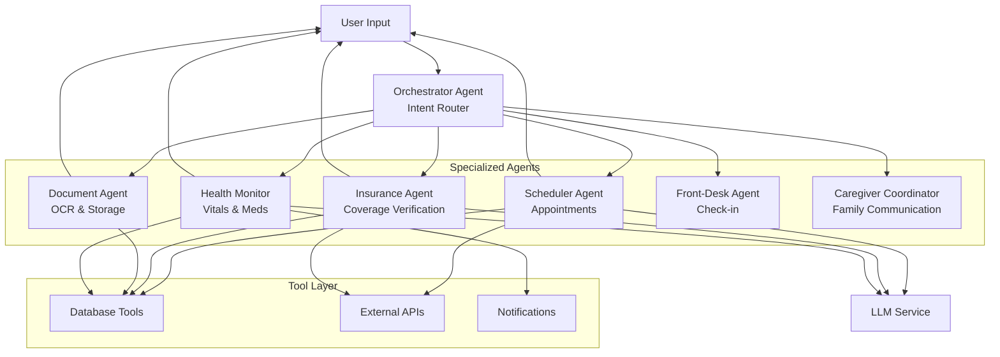
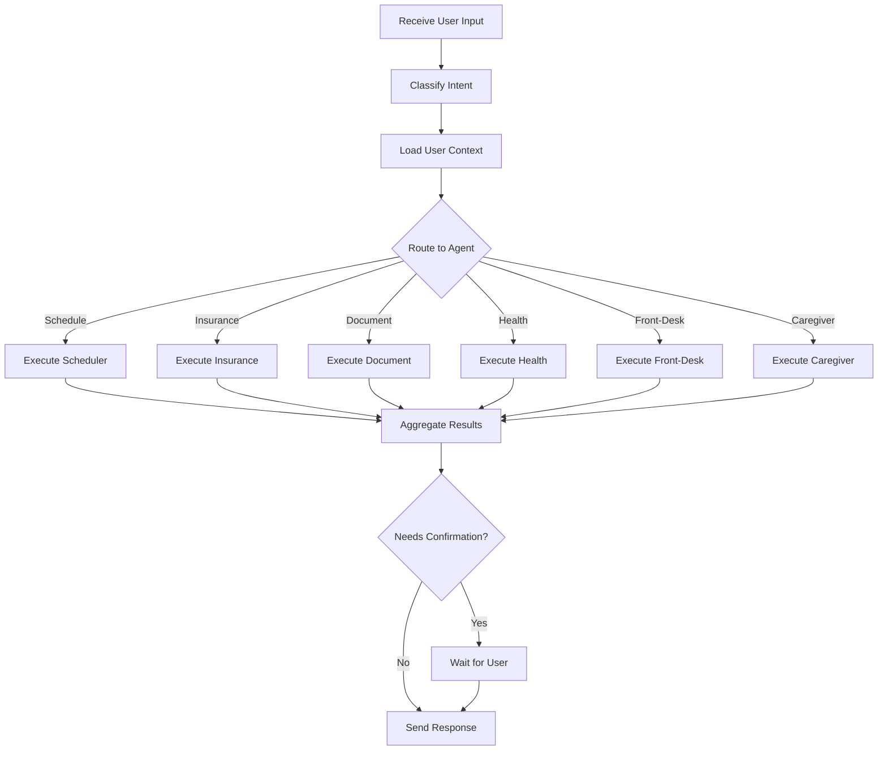
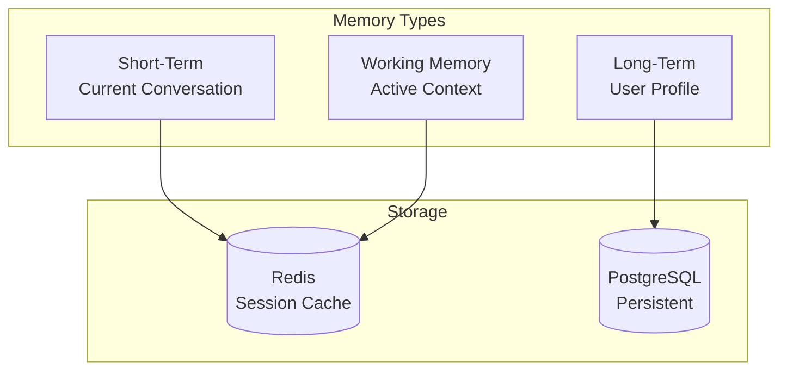
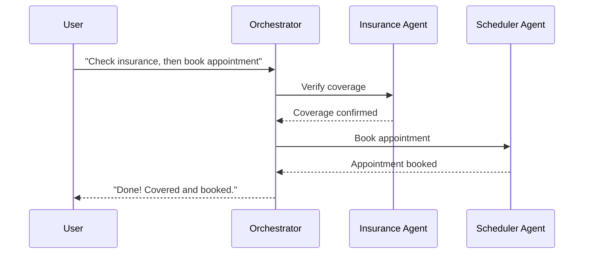
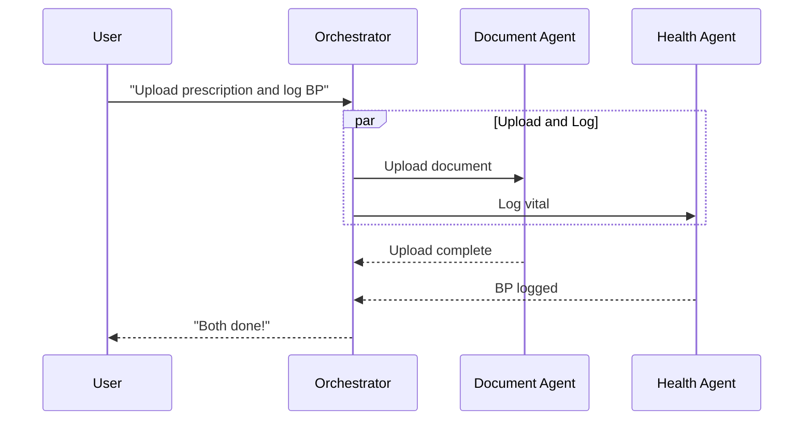
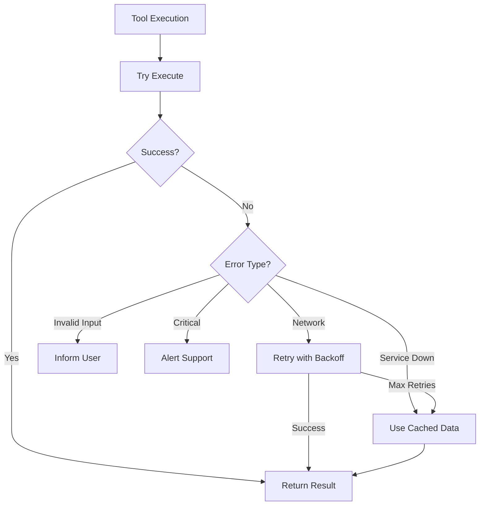

# EcareBots AI Agent Design

**Document Version:** 1.0  
**Date:** November 27, 2025  
**Author:** EcareBots Architecture Team  
**Status:** Day 3 Deliverable - AI Agent Specifications

---

## Executive Summary

This document specifies the AI agent architecture for EcareBots, implementing a multi-agent system for autonomous healthcare coordination through natural language conversation, reasoning, and tool execution. The design uses custom orchestration patterns inspired by research in ReAct (Reasoning + Acting) and Chain-of-Thought prompting.

**Core Architecture**:
- **1 Orchestrator Agent**: Routes requests, manages conversation state
- **6 Specialized Agents**: Domain-specific healthcare coordination
- **Tool-Use Pattern**: Function calling for database and API operations
- **Reasoning Frameworks**: ReAct for sequential tasks, CoT for complex reasoning
- **State Management**: Persistent conversation context

---

## Table of Contents

1. [Agent Architecture Overview](#agent-architecture-overview)
2. [Orchestrator Agent](#orchestrator-agent)
3. [Specialized Agent Specifications](#specialized-agent-specifications)
4. [Reasoning Frameworks](#reasoning-frameworks)
5. [Tool Design](#tool-design)
6. [Memory Management](#memory-management)
7. [Multi-Agent Coordination](#multi-agent-coordination)
8. [Error Handling](#error-handling)
9. [Performance Monitoring](#performance-monitoring)

---

## Agent Architecture Overview

### Design Principles

1. **Single Responsibility**: Each agent handles one domain
2. **Tool-Augmented**: Agents use tools for real data access
3. **Stateful Conversations**: Context maintained across turns
4. **Human-in-the-Loop**: Critical actions require confirmation
5. **Explainable**: Reasoning steps visible to users
6. **Graceful Degradation**: Core features work without AI

### Agent System Diagram



---

## Orchestrator Agent

### Responsibilities

1. **Intent Classification**: Determine user's goal
2. **Agent Routing**: Select appropriate specialized agent
3. **Context Management**: Maintain conversation state
4. **Response Synthesis**: Combine multi-agent results
5. **Confirmation Handling**: Manage user approvals

### Intent Classification

**Hybrid Approach**: Rule-based + ML-based

#### Rule-Based (Fast Path)

| Intent | Keywords | Agent |
|--------|----------|-------|
| Schedule | "book", "appointment", "schedule" | Scheduler |
| Insurance | "insurance", "coverage", "policy" | Insurance |
| Document | "upload", "document", "prescription" | Document |
| Medication | "medication", "pill", "reminder" | Health Monitor |
| Check-in | "check-in", "arrived", "waiting" | Front-Desk |
| Caregiver | "call family", "notify", "tell my" | Caregiver |

#### ML-Based Classification

**Function Calling Schema**:
```typescript
const intentSchema = {
  name: "classify_intent",
  description: "Classify user's healthcare intent",
  parameters: {
    type: "object",
    properties: {
      primary_intent: {
        type: "string",
        enum: ["schedule", "insurance", "document", 
               "medication", "check_in", "caregiver"]
      },
      entities: {
        type: "object",
        properties: {
          doctor_name: { type: "string" },
          date: { type: "string" },
          medication: { type: "string" }
        }
      },
      confidence: { type: "number" }
    }
  }
};
```

**Example Classification**:

Input: "I need to see Dr. Smith next week about my blood pressure medication"

Output:
```json
{
  "primary_intent": "schedule",
  "secondary_intents": ["medication"],
  "entities": {
    "doctor_name": "Dr. Smith",
    "timeframe": "next week",
    "reason": "blood pressure medication"
  },
  "confidence": 0.95
}
```

### Orchestrator Flow



---

## Specialized Agent Specifications

### 1. Scheduler Agent

**Domain**: Appointment scheduling and reminders

**Capabilities**:
- Find doctor availability
- Book appointments
- Reschedule/cancel appointments
- Set medication reminders
- Calendar conflict detection

**Reasoning Pattern**: ReAct (Reasoning + Acting)

**Example ReAct Execution**:

```
User: "Book an appointment with Dr. Johnson next Tuesday"

--- ReAct Cycle ---

Thought 1: User wants appointment with Dr. Johnson. Check if preferred doctor.
Action 1: query_user_profile(user_id="123", field="preferred_doctors")
Observation 1: Dr. Johnson is preferred cardiologist.

Thought 2: Check Dr. Johnson's availability next Tuesday (Dec 3).
Action 2: check_doctor_availability(doctor_id="dr_j_456", date="2025-12-03")
Observation 2: Available slots: 10:00 AM, 2:00 PM, 4:00 PM.

Thought 3: Present options to user.
Action 3: present_options(slots=["10:00 AM", "2:00 PM", "4:00 PM"])
Observation 3: User selects 2:00 PM.

Thought 4: Book the appointment.
Action 4: book_appointment(doctor_id="dr_j_456", datetime="2025-12-03T14:00:00")
Observation 4: Appointment confirmed, ID: apt_789.

Thought 5: Set reminders.
Action 5: create_reminders(appointment_id="apt_789")
Observation 5: Reminders created (24h, 1h before).

Final: "Appointment booked with Dr. Johnson for Tuesday, Dec 3 at 2:00 PM."
```

**Tools**:

| Tool | Purpose | Data Source |
|------|---------|-------------|
| `query_user_profile` | Get user preferences | Database |
| `check_doctor_availability` | Query available slots | FHIR API |
| `book_appointment` | Create appointment | FHIR + DB |
| `cancel_appointment` | Cancel existing | FHIR + DB |
| `create_reminders` | Schedule notifications | Notification Service |
| `find_nearby_clinics` | Search by specialty | Clinic Directory |

### 2. Insurance Agent

**Domain**: Insurance verification and optimization

**Capabilities**:
- Verify coverage
- Estimate out-of-pocket costs
- Compare insurance plans
- Track claims
- Find in-network providers

**Reasoning Pattern**: Chain-of-Thought for complex analysis

**Example CoT Execution**:

```
User: "Is my blood pressure medication covered?"

--- Chain-of-Thought ---

Step 1: Identify medication
- Query user's medications
- Result: Lisinopril 10mg, prescribed by Dr. Johnson

Step 2: Retrieve insurance policy
- Query insurance_policies table
- Result: BlueCross PPO, Policy #BC12345, active until 12/31/2025

Step 3: Check formulary
- Call insurance API: check_drug_coverage("Lisinopril", "BC12345")
- Result: Tier 1 generic, $10 copay, no prior auth

Step 4: Check prescription status
- Last filled: 2 weeks ago, 30-day supply, 2 refills left

Step 5: Calculate next refill eligibility
- Next refill: Dec 12, 2025
- Coverage active: Yes

Step 6: Cost optimization
- Mail-order option: $25 for 90-day supply
- Retail option: $10 per 30-day (3x = $30)
- Savings: $5 per 90 days

Response: "Yes, Lisinopril is covered. $10 copay per month. 
Tip: Save $5 by using mail-order for 90-day supply."
```

**Tools**:

| Tool | Purpose | Data Source |
|------|---------|-------------|
| `get_insurance_policies` | Retrieve policies | Database |
| `check_drug_coverage` | Verify medication coverage | Insurance API |
| `check_procedure_coverage` | Verify procedure coverage | Insurance API |
| `calculate_out_of_pocket` | Estimate costs | Calculation |
| `find_in_network` | Search providers | Insurance API |
| `compare_plans` | Plan comparison | Insurance API + KB |

### 3. Document Agent

**Domain**: Medical document management

**Capabilities**:
- Upload documents
- OCR text extraction
- Document categorization
- Expiry tracking
- Secure sharing

**Privacy-First**: Uses local OCR models where possible

**Tools**:

| Tool | Purpose | Implementation |
|------|---------|----------------|
| `upload_document` | Store document | Object Storage |
| `extract_text_ocr` | OCR processing | Tesseract/Azure CV |
| `classify_document` | Auto-categorize | Local ML Model |
| `extract_expiry` | Parse expiry date | Regex + NLP |
| `set_expiry_reminder` | Create alert | Notification Service |
| `generate_share_link` | Secure link | Signed URL |

### 4. Health Monitor Agent

**Domain**: Health tracking and alerts

**Capabilities**:
- Log vitals (BP, glucose, weight)
- Track medication adherence
- Analyze health trends
- Generate alerts
- Create health reports

**Example Trend Analysis**:

```
User: "Log my blood pressure: 145/95"

--- Health Monitor Reasoning ---

Step 1: Validate and store
- Values valid: Yes (within normal range)
- Concern: Elevated (stage 1 hypertension)
- Store in vitals table

Step 2: Retrieve history
- Last 30 days: 8 readings, avg 138/88

Step 3: Analyze trend
- Trend: Increasing (last 3 readings >140/90)
- Concern level: Moderate

Step 4: Check medication adherence
- Lisinopril: 27/30 days (90% adherence)
- Missed doses: 3 days

Step 5: Check upcoming appointments
- Dr. Johnson: Dec 3 (7 days away)

Step 6: Determine action
- Not emergency (BP <180/120)
- Has upcoming visit
- Action: Log, remind about medication, monitor

Response: "BP logged: 145/95. Higher than your average. 
Reminder: Take Lisinopril daily - you have a Dr. Johnson visit in 7 days. 
If BP exceeds 160/100, contact your doctor immediately."
```

**Tools**:

| Tool | Purpose | Data Source |
|------|---------|-------------|
| `log_vital_sign` | Record measurement | Database |
| `get_vital_history` | Retrieve trends | Database |
| `calculate_trend` | Trend analysis | Calculation |
| `check_adherence` | Medication compliance | Database |
| `send_health_alert` | Notify user/caregiver | Notification |
| `generate_report` | Health summary | Report Generator |

### 5. Front-Desk Agent

**Domain**: Clinic check-in automation

**Capabilities**:
- Virtual check-in
- Pre-fill forms
- Verify insurance
- Process copay
- Manage queue

**Tools**:

| Tool | Purpose | Data Source |
|------|---------|-------------|
| `check_in_appointment` | Mark as arrived | Clinic API |
| `get_required_forms` | Retrieve forms | Clinic API |
| `pre_fill_forms` | Auto-complete | Database |
| `verify_insurance_realtime` | Confirm coverage | Insurance API |
| `process_copay` | Handle payment | Payment API |
| `get_wait_time` | Queue status | Clinic Queue API |

### 6. Caregiver Coordinator Agent

**Domain**: Family/caregiver communication

**Capabilities**:
- Notify caregivers
- Share health updates
- Emergency contact
- Consent management
- Audit logging

**Privacy-Aware Design**:
- Granular permissions per caregiver
- Explicit patient consent
- Audit trail for all access

**Tools**:

| Tool | Purpose | Data Source |
|------|---------|-------------|
| `get_authorized_caregivers` | List with consent | Database |
| `send_caregiver_notification` | Alert caregiver | Notification |
| `check_permissions` | Verify access | Database |
| `share_health_update` | Send update | Notification |
| `request_assistance` | Ask for help | Notification |
| `log_access` | Audit trail | Database |

---

## Reasoning Frameworks

### 1. ReAct (Reasoning + Acting)

**When to Use**: Sequential tasks with external tools

**Pattern**:
```
Thought: Analyze situation
Action: Execute tool
Observation: Result
Thought: Reason about result
Action: Next tool
... (repeat)
Final Answer: Response
```

**Agents Using ReAct**: Scheduler, Front-Desk

### 2. Chain-of-Thought (CoT)

**When to Use**: Complex reasoning without immediate actions

**Pattern**:
```
Problem: User request
Step 1: Break down problem
Step 2: Reason through first part
Step 3: Build on previous reasoning
...
Conclusion: Final answer
```

**Agents Using CoT**: Insurance, Health Monitor

### 3. Plan-and-Execute

**When to Use**: Multi-agent coordination

**Pattern**:
```
1. Plan:
   - Sub-task A → Agent 1
   - Sub-task B → Agent 2 (parallel)
   - Sub-task C → Agent 3 (after A)

2. Execute:
   - Run A and B in parallel
   - Wait for A to complete
   - Run C

3. Aggregate:
   - Combine results

4. Respond:
   - Unified response
```

**Example**: "Book appointment, verify insurance, upload prescription"
- Plan: (1) Insurance check, (2) Document upload (parallel), then (3) Schedule
- Execute: 1 & 2 parallel, then 3
- Aggregate: All completed
- Respond: "All done!"

---

## Tool Design

### Tool Function Schema

```typescript
interface Tool {
  name: string;
  description: string;
  parameters: {
    type: "object";
    properties: Record<string, {
      type: string;
      description: string;
      enum?: string[];
    }>;
    required: string[];
  };
  execute: (params: any) => Promise<any>;
}
```

### Example Tool: Book Appointment

```typescript
const bookAppointmentTool: Tool = {
  name: "book_appointment",
  description: "Create appointment in database and EHR",
  parameters: {
    type: "object",
    properties: {
      patient_id: { 
        type: "string",
        description: "Patient UUID"
      },
      doctor_id: {
        type: "string",
        description: "Doctor UUID"
      },
      appointment_datetime: {
        type: "string",
        description: "ISO 8601 datetime"
      },
      reason: {
        type: "string",
        description: "Reason for visit"
      }
    },
    required: ["patient_id", "doctor_id", "appointment_datetime"]
  },
  execute: async (params) => {
    // 1. Insert into database
    const appointment = await db.appointments.create(params);
    
    // 2. Sync with FHIR server
    await fhirClient.createAppointment(appointment);
    
    // 3. Send notifications
    await notificationService.sendConfirmation(params.patient_id);
    
    return appointment;
  }
};
```

---

## Memory Management

### Memory Layers



**Short-Term (30 min TTL)**:
- Last 10 conversation turns
- Current agent state
- Pending confirmations

**Working Memory (1 hour TTL)**:
- Retrieved user context
- Cached API responses
- Intermediate results

**Long-Term (Persistent)**:
- User profile
- Conversation summaries
- Historical health data

---

## Multi-Agent Coordination

### Coordination Patterns

#### 1. Sequential



#### 2. Parallel



---

## Error Handling

### Error Handling Flow



### Error Patterns

1. **Transient Errors**: Retry with exponential backoff
2. **Invalid Input**: Clarify with user
3. **Service Unavailable**: Use cached data, queue for later
4. **Critical Failure**: Alert support, apologize to user

---

## Performance Monitoring

### Key Metrics

| Metric | Target | Critical |
|--------|--------|----------|
| Agent Response Time (p95) | <2s | <5s |
| Tool Execution Time (p95) | <500ms | <2s |
| Intent Classification Accuracy | >95% | >90% |
| Task Completion Rate | >90% | >85% |

### Monitoring Implementation

```typescript
class AgentMonitor {
  async trackExecution(agentName: string, task: string) {
    const start = Date.now();
    
    try {
      const result = await executeAgent(agentName, task);
      const duration = Date.now() - start;
      
      await logger.info({
        event: "agent_execution",
        agent: agentName,
        task_type: task,
        duration_ms: duration,
        status: "success"
      });
      
      return result;
    } catch (error) {
      await logger.error({
        event: "agent_error",
        agent: agentName,
        error: error.message
      });
      
      throw error;
    }
  }
}
```

---

## Summary

This AI agent design provides:

✅ **Custom orchestration** tailored for healthcare coordination  
✅ **6 specialized agents** with clear domain boundaries  
✅ **ReAct + CoT reasoning** for intelligent task execution  
✅ **Tool-augmented approach** grounded in real data  
✅ **Privacy-aware design** with audit logging and consent  
✅ **Performance monitoring** for production reliability  

Next document: Multi-Modal Processing Pipeline  
→ `architecture/multimodal-pipeline.md`

---

**Document Status**: Complete - Day 3 Deliverable (2/3)  
**Date**: November 27, 2025