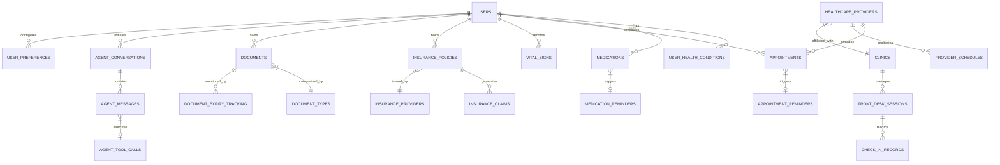

# EcareBots Database Schema Design

**Version:** 1.0  
**Last Updated:** November 30, 2025  
**Author:** EcareBots Research & Architecture Team

---

## Executive Summary

This document presents a comprehensive database schema design for EcareBots, an AI-powered healthcare coordination platform optimized for accessibility. The schema is designed on PostgreSQL (via Supabase) to leverage ACID compliance, Row-Level Security (RLS), and FHIR-alignment principles for healthcare interoperability[web:127][web:130]. The database accommodates multi-modal user interactions, health schedule tracking, insurance management, document lifecycle tracking, and AI agent conversation logging while maintaining HIPAA-ready security patterns[web:86][web:127].

The schema supports:
- **User Management**: Patients, caregivers, healthcare providers with role-based access
- **Health Data**: Medications, appointments, vital signs with temporal tracking
- **Insurance & Billing**: Policy management, claims, coverage verification
- **Document Management**: Medical records, prescriptions, insurance cards with expiry tracking
- **AI Agent Interactions**: Conversation history, intent logs, tool usage analytics
- **Clinic Operations**: Provider directories, schedules, front-desk automation data

---

## 1. Database Technology Selection

### 1.1 PostgreSQL via Supabase

**Rationale:**
- **ACID Compliance**: Ensures data consistency critical for healthcare applications[web:10][web:67]
- **Row-Level Security (RLS)**: Native support for HIPAA-compliant access control, enforcing "minimum necessary" rule[web:127][web:130]
- **FHIR Compatibility**: PostgreSQL is widely used for FHIR data storage with JSON/JSONB support[web:20][web:21][web:155]
- **Real-time Capabilities**: Supabase provides WebSocket-based real-time subscriptions via PostgreSQL logical replication[web:180]
- **Scalability**: Proven in large healthcare implementations handling millions of patient records[web:85]

**Supabase Advantages for Healthcare**[web:84][web:178][web:180]:
- Built-in authentication with JWT + RLS integration
- Auto-generated REST and GraphQL APIs
- S3-compatible storage for medical documents
- Read replicas for scaling read-heavy workloads
- Self-hosting option for enhanced data sovereignty

### 1.2 Alternative Considerations

| Database | Pros | Cons | Verdict |
|----------|------|------|---------|
| **PostgreSQL/Supabase** | Strong ACID, RLS, SQL, FHIR-ready | Manual tuning for high traffic | ✅ **Selected** |
| **Firebase/Firestore** | Real-time sync, auto-scaling | NoSQL limits complex queries, vendor lock-in | ❌ Not suitable for relational health data |
| **MongoDB** | Flexible schema, horizontal scaling | No native ACID across collections, weak for complex joins | ❌ Suboptimal for structured healthcare data |

---

## 2. High-Level Entity-Relationship Diagram



---

## 3. Core Entity Definitions

### 3.1 User Management Schema

#### 3.1.1 USERS Table

**Purpose**: Central user registry for patients, caregivers, and healthcare staff.

```sql
CREATE TABLE users (
    id UUID PRIMARY KEY DEFAULT gen_random_uuid(),
    auth_id UUID UNIQUE REFERENCES auth.users(id) ON DELETE CASCADE,
    
    -- Personal Information
    email VARCHAR(255) UNIQUE NOT NULL,
    phone_number VARCHAR(20),
    full_name VARCHAR(255) NOT NULL,
    date_of_birth DATE,
    gender VARCHAR(20),
    
    -- Role & Access
    role VARCHAR(50) NOT NULL CHECK (role IN ('patient', 'caregiver', 'healthcare_provider', 'admin')),
    is_primary_user BOOLEAN DEFAULT TRUE,
    linked_user_id UUID REFERENCES users(id), -- For caregiver-patient relationships
    
    -- Profile & Accessibility
    profile_photo_url TEXT,
    preferred_language VARCHAR(10) DEFAULT 'en',
    accessibility_preferences JSONB, -- {voice_speed: 1.0, high_contrast: true, gesture_enabled: true}
    
    -- Medical Context
    emergency_contact JSONB, -- {name, phone, relationship}
    blood_type VARCHAR(5),
    allergies TEXT[],
    
    -- Metadata
    created_at TIMESTAMP WITH TIME ZONE DEFAULT NOW(),
    updated_at TIMESTAMP WITH TIME ZONE DEFAULT NOW(),
    last_login_at TIMESTAMP WITH TIME ZONE,
    is_active BOOLEAN DEFAULT TRUE
);

-- Indexes for performance
CREATE INDEX idx_users_auth_id ON users(auth_id);
CREATE INDEX idx_users_role ON users(role);
CREATE INDEX idx_users_linked_user ON users(linked_user_id);
CREATE INDEX idx_users_email ON users(email);

-- Row-Level Security Policies
ALTER TABLE users ENABLE ROW LEVEL SECURITY;

CREATE POLICY "Users can view their own profile"
    ON users FOR SELECT
    USING (auth.uid() = auth_id);

CREATE POLICY "Users can update their own profile"
    ON users FOR UPDATE
    USING (auth.uid() = auth_id);

CREATE POLICY "Caregivers can view linked patients"
    ON users FOR SELECT
    USING (
        auth.uid() IN (
            SELECT auth_id FROM users WHERE id = users.linked_user_id
        )
    );
```

**Design Rationale**:
- **UUID Primary Keys**: Prevents enumeration attacks and supports distributed systems[web:122]
- **JSONB Fields**: Flexible storage for evolving accessibility preferences without schema changes
- **RLS Policies**: Enforces HIPAA compliance at database level[web:127][web:130]
- **Text Arrays for Allergies**: Efficient querying and indexing for critical medical information

#### 3.1.2 USER_HEALTH_CONDITIONS Table

```sql
CREATE TABLE user_health_conditions (
    id UUID PRIMARY KEY DEFAULT gen_random_uuid(),
    user_id UUID NOT NULL REFERENCES users(id) ON DELETE CASCADE,
    
    -- Condition Details
    condition_name VARCHAR(255) NOT NULL,
    icd10_code VARCHAR(10), -- International Classification of Diseases code
    severity VARCHAR(20) CHECK (severity IN ('mild', 'moderate', 'severe', 'critical')),
    
    -- Timeline
    diagnosed_date DATE,
    resolved_date DATE,
    is_chronic BOOLEAN DEFAULT FALSE,
    
    -- Clinical Notes
    notes TEXT,
    managing_provider_id UUID REFERENCES healthcare_providers(id),
    
    -- Metadata
    created_at TIMESTAMP WITH TIME ZONE DEFAULT NOW(),
    updated_at TIMESTAMP WITH TIME ZONE DEFAULT NOW()
);

CREATE INDEX idx_health_conditions_user ON user_health_conditions(user_id);
CREATE INDEX idx_health_conditions_icd10 ON user_health_conditions(icd10_code);

ALTER TABLE user_health_conditions ENABLE ROW LEVEL SECURITY;

CREATE POLICY "Users can view their health conditions"
    ON user_health_conditions FOR SELECT
    USING (user_id IN (SELECT id FROM users WHERE auth_id = auth.uid()));
```

---

### 3.2 Health Schedule Management

#### 3.2.1 MEDICATIONS Table

**Purpose**: Track all medications with dosage, frequency, and adherence monitoring.

```sql
CREATE TABLE medications (
    id UUID PRIMARY KEY DEFAULT gen_random_uuid(),
    user_id UUID NOT NULL REFERENCES users(id) ON DELETE CASCADE,
    
    -- Medication Details
    medication_name VARCHAR(255) NOT NULL,
    generic_name VARCHAR(255),
    dosage VARCHAR(100) NOT NULL, -- e.g., "10mg", "1 tablet"
    frequency VARCHAR(100) NOT NULL, -- e.g., "twice daily", "every 8 hours"
    route VARCHAR(50), -- oral, topical, injection, etc.
    
    -- Schedule
    start_date DATE NOT NULL,
    end_date DATE,
    times_per_day INTEGER DEFAULT 1,
    specific_times TIME[], -- [08:00, 20:00] for twice daily
    
    -- Prescription Info
    prescribing_provider_id UUID REFERENCES healthcare_providers(id),
    prescription_number VARCHAR(100),
    refills_remaining INTEGER DEFAULT 0,
    
    -- Instructions
    instructions TEXT,
    side_effects TEXT,
    interactions TEXT,
    
    -- Status
    is_active BOOLEAN DEFAULT TRUE,
    discontinue_reason TEXT,
    
    -- Metadata
    created_at TIMESTAMP WITH TIME ZONE DEFAULT NOW(),
    updated_at TIMESTAMP WITH TIME ZONE DEFAULT NOW()
);

CREATE INDEX idx_medications_user ON medications(user_id);
CREATE INDEX idx_medications_active ON medications(is_active) WHERE is_active = TRUE;
CREATE INDEX idx_medications_dates ON medications(start_date, end_date);

ALTER TABLE medications ENABLE ROW LEVEL SECURITY;

CREATE POLICY "Users can manage their medications"
    ON medications FOR ALL
    USING (user_id IN (SELECT id FROM users WHERE auth_id = auth.uid()));
```

#### 3.2.2 MEDICATION_REMINDERS Table

```sql
CREATE TABLE medication_reminders (
    id UUID PRIMARY KEY DEFAULT gen_random_uuid(),
    medication_id UUID NOT NULL REFERENCES medications(id) ON DELETE CASCADE,
    user_id UUID NOT NULL REFERENCES users(id) ON DELETE CASCADE,
    
    -- Reminder Details
    scheduled_time TIMESTAMP WITH TIME ZONE NOT NULL,
    reminder_type VARCHAR(20) DEFAULT 'push' CHECK (reminder_type IN ('push', 'voice', 'sms', 'email')),
    
    -- Tracking
    status VARCHAR(20) DEFAULT 'pending' CHECK (status IN ('pending', 'sent', 'acknowledged', 'taken', 'skipped', 'failed')),
    acknowledged_at TIMESTAMP WITH TIME ZONE,
    taken_at TIMESTAMP WITH TIME ZONE,
    
    -- Adherence
    was_on_time BOOLEAN,
    skip_reason TEXT,
    
    -- Metadata
    created_at TIMESTAMP WITH TIME ZONE DEFAULT NOW(),
    updated_at TIMESTAMP WITH TIME ZONE DEFAULT NOW()
);

CREATE INDEX idx_med_reminders_scheduled ON medication_reminders(scheduled_time);
CREATE INDEX idx_med_reminders_status ON medication_reminders(status);
CREATE INDEX idx_med_reminders_user_date ON medication_reminders(user_id, scheduled_time);

ALTER TABLE medication_reminders ENABLE ROW LEVEL SECURITY;
```

**Design Rationale**:
- Separate reminders table enables adherence analytics without modifying medication records[web:118][web:121]
- Time-series indexing optimizes queries for upcoming reminders
- Status tracking supports medication adherence studies showing 6.7-32.7% improvement rates[web:58]

#### 3.2.3 APPOINTMENTS Table

```sql
CREATE TABLE appointments (
    id UUID PRIMARY KEY DEFAULT gen_random_uuid(),
    user_id UUID NOT NULL REFERENCES users(id) ON DELETE CASCADE,
    provider_id UUID REFERENCES healthcare_providers(id),
    clinic_id UUID REFERENCES clinics(id),
    
    -- Scheduling
    appointment_date DATE NOT NULL,
    appointment_time TIME NOT NULL,
    duration_minutes INTEGER DEFAULT 30,
    appointment_type VARCHAR(50), -- consultation, follow-up, procedure, telehealth
    
    -- Status Management
    status VARCHAR(20) DEFAULT 'scheduled' CHECK (status IN ('scheduled', 'confirmed', 'in_progress', 'completed', 'cancelled', 'no_show')),
    cancellation_reason TEXT,
    cancelled_by VARCHAR(50), -- patient, provider, system
    
    -- Clinical Details
    chief_complaint TEXT,
    visit_reason TEXT NOT NULL,
    diagnosis_codes TEXT[], -- ICD-10 codes
    notes TEXT,
    
    -- Integration
    external_appointment_id VARCHAR(255), -- From EHR system
    booking_source VARCHAR(50), -- voice, web, mobile, agent
    
    -- Metadata
    created_at TIMESTAMP WITH TIME ZONE DEFAULT NOW(),
    updated_at TIMESTAMP WITH TIME ZONE DEFAULT NOW(),
    
    -- Prevent double-booking constraint
    CONSTRAINT no_provider_overlap EXCLUDE USING gist (
        provider_id WITH =,
        tstzrange(
            (appointment_date + appointment_time)::TIMESTAMP,
            (appointment_date + appointment_time + (duration_minutes || ' minutes')::INTERVAL)::TIMESTAMP
        ) WITH &&
    ) WHERE (status NOT IN ('cancelled', 'no_show'))
);

CREATE INDEX idx_appointments_user ON appointments(user_id);
CREATE INDEX idx_appointments_provider ON appointments(provider_id);
CREATE INDEX idx_appointments_date ON appointments(appointment_date);
CREATE INDEX idx_appointments_datetime ON appointments(appointment_date, appointment_time);
CREATE INDEX idx_appointments_status ON appointments(status);

ALTER TABLE appointments ENABLE ROW LEVEL SECURITY;
```

**Design Rationale**:
- **Exclusion Constraint**: Prevents double-booking at database level, crucial for real-time scheduling[web:107][web:154]
- **Temporal Indexing**: Optimizes queries for upcoming appointments and provider availability
- **Status Workflow**: Supports complete appointment lifecycle tracking for clinic operations[web:57][web:126]

#### 3.2.4 VITAL_SIGNS Table

```sql
CREATE TABLE vital_signs (
    id UUID PRIMARY KEY DEFAULT gen_random_uuid(),
    user_id UUID NOT NULL REFERENCES users(id) ON DELETE CASCADE,
    
    -- Measurements
    measurement_date TIMESTAMP WITH TIME ZONE DEFAULT NOW(),
    
    -- Vital Signs Data
    systolic_bp INTEGER, -- mmHg
    diastolic_bp INTEGER, -- mmHg
    heart_rate INTEGER, -- bpm
    temperature DECIMAL(4,1), -- Fahrenheit
    respiratory_rate INTEGER, -- breaths per minute
    oxygen_saturation INTEGER, -- percentage
    blood_glucose INTEGER, -- mg/dL
    weight_lbs DECIMAL(5,1),
    
    -- Context
    measurement_method VARCHAR(50), -- manual, wearable, clinical
    device_id VARCHAR(100), -- For wearable integrations
    notes TEXT,
    
    -- Metadata
    created_at TIMESTAMP WITH TIME ZONE DEFAULT NOW()
);

CREATE INDEX idx_vitals_user_date ON vital_signs(user_id, measurement_date DESC);
CREATE INDEX idx_vitals_measurement_date ON vital_signs(measurement_date);

ALTER TABLE vital_signs ENABLE ROW LEVEL SECURITY;
```

---

### 3.3 Insurance & Billing Management

#### 3.3.1 INSURANCE_PROVIDERS Table

```sql
CREATE TABLE insurance_providers (
    id UUID PRIMARY KEY DEFAULT gen_random_uuid(),
    
    -- Provider Information
    provider_name VARCHAR(255) NOT NULL UNIQUE,
    provider_code VARCHAR(50),
    provider_type VARCHAR(50), -- private, medicare, medicaid, government
    
    -- Contact
    phone_number VARCHAR(20),
    website_url TEXT,
    customer_service_hours VARCHAR(100),
    
    -- API Integration
    api_endpoint TEXT,
    supports_real_time_verification BOOLEAN DEFAULT FALSE,
    
    -- Metadata
    created_at TIMESTAMP WITH TIME ZONE DEFAULT NOW(),
    updated_at TIMESTAMP WITH TIME ZONE DEFAULT NOW(),
    is_active BOOLEAN DEFAULT TRUE
);

CREATE INDEX idx_insurance_providers_name ON insurance_providers(provider_name);
```

#### 3.3.2 INSURANCE_POLICIES Table

```sql
CREATE TABLE insurance_policies (
    id UUID PRIMARY KEY DEFAULT gen_random_uuid(),
    user_id UUID NOT NULL REFERENCES users(id) ON DELETE CASCADE,
    provider_id UUID NOT NULL REFERENCES insurance_providers(id),
    
    -- Policy Details
    policy_number VARCHAR(100) NOT NULL,
    group_number VARCHAR(100),
    subscriber_id VARCHAR(100),
    
    -- Coverage
    plan_name VARCHAR(255),
    plan_type VARCHAR(50), -- HMO, PPO, EPO, POS
    coverage_type VARCHAR(50), -- medical, dental, vision
    
    -- Dates
    effective_date DATE NOT NULL,
    expiration_date DATE,
    is_primary BOOLEAN DEFAULT TRUE,
    
    -- Financial
    monthly_premium DECIMAL(10,2),
    deductible_amount DECIMAL(10,2),
    deductible_met DECIMAL(10,2) DEFAULT 0.00,
    out_of_pocket_max DECIMAL(10,2),
    out_of_pocket_met DECIMAL(10,2) DEFAULT 0.00,
    copay_primary_care DECIMAL(6,2),
    copay_specialist DECIMAL(6,2),
    copay_emergency DECIMAL(6,2),
    
    -- Verification
    last_verified_at TIMESTAMP WITH TIME ZONE,
    verification_status VARCHAR(20), -- verified, pending, failed
    verification_details JSONB,
    
    -- Documents
    card_front_url TEXT,
    card_back_url TEXT,
    
    -- Metadata
    created_at TIMESTAMP WITH TIME ZONE DEFAULT NOW(),
    updated_at TIMESTAMP WITH TIME ZONE DEFAULT NOW(),
    is_active BOOLEAN DEFAULT TRUE
);

CREATE INDEX idx_insurance_policies_user ON insurance_policies(user_id);
CREATE INDEX idx_insurance_policies_expiration ON insurance_policies(expiration_date) WHERE is_active = TRUE;
CREATE INDEX idx_insurance_policies_verification ON insurance_policies(verification_status);

ALTER TABLE insurance_policies ENABLE ROW LEVEL SECURITY;
```

**Design Rationale**:
- Financial tracking fields enable automatic deductible/out-of-pocket calculations
- Verification status supports real-time eligibility checks (34% cost reduction per studies)[web:65]
- Expiration tracking enables proactive renewal reminders

#### 3.3.3 INSURANCE_CLAIMS Table

```sql
CREATE TABLE insurance_claims (
    id UUID PRIMARY KEY DEFAULT gen_random_uuid(),
    user_id UUID NOT NULL REFERENCES users(id) ON DELETE CASCADE,
    policy_id UUID NOT NULL REFERENCES insurance_policies(id),
    appointment_id UUID REFERENCES appointments(id),
    
    -- Claim Details
    claim_number VARCHAR(100) UNIQUE,
    claim_date DATE NOT NULL,
    service_date DATE NOT NULL,
    
    -- Financial
    billed_amount DECIMAL(10,2) NOT NULL,
    allowed_amount DECIMAL(10,2),
    patient_responsibility DECIMAL(10,2),
    insurance_paid DECIMAL(10,2),
    
    -- Status
    claim_status VARCHAR(30) DEFAULT 'submitted' CHECK (claim_status IN ('submitted', 'pending', 'approved', 'denied', 'appealed', 'paid')),
    denial_reason TEXT,
    
    -- Procedure Codes
    cpt_codes TEXT[], -- Current Procedural Terminology codes
    diagnosis_codes TEXT[], -- ICD-10 codes
    
    -- Metadata
    created_at TIMESTAMP WITH TIME ZONE DEFAULT NOW(),
    updated_at TIMESTAMP WITH TIME ZONE DEFAULT NOW()
);

CREATE INDEX idx_claims_user ON insurance_claims(user_id);
CREATE INDEX idx_claims_policy ON insurance_claims(policy_id);
CREATE INDEX idx_claims_status ON insurance_claims(claim_status);

ALTER TABLE insurance_claims ENABLE ROW LEVEL SECURITY;
```

---

### 3.4 Document Management System

#### 3.4.1 DOCUMENT_TYPES Table

```sql
CREATE TABLE document_types (
    id UUID PRIMARY KEY DEFAULT gen_random_uuid(),
    
    -- Type Definition
    type_name VARCHAR(100) NOT NULL UNIQUE,
    type_category VARCHAR(50), -- prescription, insurance, medical_record, test_result, vaccination
    
    -- Expiry Configuration
    has_expiry BOOLEAN DEFAULT FALSE,
    default_validity_days INTEGER,
    
    -- Display
    icon_name VARCHAR(50),
    color_code VARCHAR(7), -- Hex color for UI
    
    -- Metadata
    created_at TIMESTAMP WITH TIME ZONE DEFAULT NOW()
);

-- Seed common document types
INSERT INTO document_types (type_name, type_category, has_expiry, default_validity_days) VALUES
    ('Prescription', 'prescription', TRUE, 90),
    ('Insurance Card', 'insurance', TRUE, 365),
    ('Lab Report', 'medical_record', FALSE, NULL),
    ('Vaccination Record', 'vaccination', FALSE, NULL),
    ('Medical Imaging', 'medical_record', FALSE, NULL),
    ('Referral Letter', 'prescription', TRUE, 30);
```

#### 3.4.2 DOCUMENTS Table

```sql
CREATE TABLE documents (
    id UUID PRIMARY KEY DEFAULT gen_random_uuid(),
    user_id UUID NOT NULL REFERENCES users(id) ON DELETE CASCADE,
    document_type_id UUID NOT NULL REFERENCES document_types(id),
    
    -- Document Details
    document_name VARCHAR(255) NOT NULL,
    description TEXT,
    file_url TEXT NOT NULL, -- Supabase Storage URL
    file_type VARCHAR(50), -- pdf, jpg, png
    file_size_bytes BIGINT,
    
    -- Dates
    document_date DATE,
    issue_date DATE,
    expiry_date DATE,
    
    -- Source
    issuing_provider_id UUID REFERENCES healthcare_providers(id),
    upload_source VARCHAR(50), -- manual, ocr, integration
    
    -- OCR & Processing
    ocr_text TEXT, -- Extracted text for search
    ocr_confidence DECIMAL(3,2), -- 0.00 to 1.00
    metadata_extracted JSONB, -- Parsed fields from OCR
    
    -- Access Control
    is_shared BOOLEAN DEFAULT FALSE,
    shared_with UUID[], -- Array of user IDs
    
    -- Metadata
    created_at TIMESTAMP WITH TIME ZONE DEFAULT NOW(),
    updated_at TIMESTAMP WITH TIME ZONE DEFAULT NOW(),
    is_archived BOOLEAN DEFAULT FALSE
);

CREATE INDEX idx_documents_user ON documents(user_id);
CREATE INDEX idx_documents_type ON documents(document_type_id);
CREATE INDEX idx_documents_expiry ON documents(expiry_date) WHERE expiry_date IS NOT NULL AND is_archived = FALSE;
CREATE INDEX idx_documents_ocr_search ON documents USING gin(to_tsvector('english', ocr_text));

ALTER TABLE documents ENABLE ROW LEVEL SECURITY;
```

**Design Rationale**:
- **Full-text search** on OCR text enables voice queries like "find my blood test from last month"
- **Expiry tracking** prevents use of outdated documents (100% error prevention per studies)[web:58]
- **Shared documents** support caregiver access patterns

#### 3.4.3 DOCUMENT_EXPIRY_TRACKING Table

```sql
CREATE TABLE document_expiry_tracking (
    id UUID PRIMARY KEY DEFAULT gen_random_uuid(),
    document_id UUID NOT NULL REFERENCES documents(id) ON DELETE CASCADE,
    user_id UUID NOT NULL REFERENCES users(id),
    
    -- Alert Configuration
    days_before_expiry INTEGER[] DEFAULT ARRAY[30, 7, 1], -- Alert at 30, 7, and 1 day before
    
    -- Notification History
    last_alerted_at TIMESTAMP WITH TIME ZONE,
    alerts_sent INTEGER DEFAULT 0,
    
    -- Status
    is_renewal_required BOOLEAN DEFAULT FALSE,
    renewal_requested_at TIMESTAMP WITH TIME ZONE,
    renewal_status VARCHAR(30), -- pending, in_progress, completed
    
    -- Metadata
    created_at TIMESTAMP WITH TIME ZONE DEFAULT NOW()
);

CREATE INDEX idx_expiry_tracking_document ON document_expiry_tracking(document_id);
CREATE INDEX idx_expiry_tracking_user ON document_expiry_tracking(user_id);
```

---

### 3.5 Healthcare Provider Directory

#### 3.5.1 CLINICS Table

```sql
CREATE TABLE clinics (
    id UUID PRIMARY KEY DEFAULT gen_random_uuid(),
    
    -- Clinic Information
    clinic_name VARCHAR(255) NOT NULL,
    clinic_type VARCHAR(50), -- hospital, clinic, urgent_care, specialty
    
    -- Location
    address_line1 VARCHAR(255),
    address_line2 VARCHAR(255),
    city VARCHAR(100),
    state VARCHAR(50),
    zip_code VARCHAR(10),
    country VARCHAR(50) DEFAULT 'USA',
    latitude DECIMAL(10, 7),
    longitude DECIMAL(10, 7),
    
    -- Contact
    phone_number VARCHAR(20),
    fax_number VARCHAR(20),
    email VARCHAR(255),
    website_url TEXT,
    
    -- Operations
    operating_hours JSONB, -- {mon: "9AM-5PM", tue: "9AM-5PM", ...}
    accepts_walk_ins BOOLEAN DEFAULT FALSE,
    
    -- Integration
    ehr_system VARCHAR(100), -- Epic, Cerner, etc.
    supports_fhir BOOLEAN DEFAULT FALSE,
    api_endpoint TEXT,
    
    -- Metadata
    created_at TIMESTAMP WITH TIME ZONE DEFAULT NOW(),
    updated_at TIMESTAMP WITH TIME ZONE DEFAULT NOW(),
    is_active BOOLEAN DEFAULT TRUE
);

CREATE INDEX idx_clinics_location ON clinics(latitude, longitude);
CREATE INDEX idx_clinics_type ON clinics(clinic_type);
```

#### 3.5.2 HEALTHCARE_PROVIDERS Table

```sql
CREATE TABLE healthcare_providers (
    id UUID PRIMARY KEY DEFAULT gen_random_uuid(),
    user_id UUID REFERENCES users(id), -- If provider has user account
    
    -- Provider Information
    npi_number VARCHAR(10) UNIQUE, -- National Provider Identifier
    first_name VARCHAR(100) NOT NULL,
    last_name VARCHAR(100) NOT NULL,
    credentials VARCHAR(50), -- MD, DO, NP, PA, RN
    specialty VARCHAR(100),
    sub_specialty VARCHAR(100),
    
    -- Affiliation
    primary_clinic_id UUID REFERENCES clinics(id),
    
    -- Contact
    office_phone VARCHAR(20),
    email VARCHAR(255),
    
    -- Licensing
    license_number VARCHAR(50),
    license_state VARCHAR(50),
    license_expiry_date DATE,
    
    -- Scheduling
    accepts_new_patients BOOLEAN DEFAULT TRUE,
    average_appointment_duration INTEGER DEFAULT 30, -- minutes
    
    -- Ratings
    rating DECIMAL(2,1) CHECK (rating >= 0 AND rating <= 5),
    review_count INTEGER DEFAULT 0,
    
    -- Metadata
    created_at TIMESTAMP WITH TIME ZONE DEFAULT NOW(),
    updated_at TIMESTAMP WITH TIME ZONE DEFAULT NOW(),
    is_active BOOLEAN DEFAULT TRUE
);

CREATE INDEX idx_providers_npi ON healthcare_providers(npi_number);
CREATE INDEX idx_providers_specialty ON healthcare_providers(specialty);
CREATE INDEX idx_providers_clinic ON healthcare_providers(primary_clinic_id);
```

#### 3.5.3 PROVIDER_SCHEDULES Table

```sql
CREATE TABLE provider_schedules (
    id UUID PRIMARY KEY DEFAULT gen_random_uuid(),
    provider_id UUID NOT NULL REFERENCES healthcare_providers(id) ON DELETE CASCADE,
    clinic_id UUID REFERENCES clinics(id),
    
    -- Schedule Details
    day_of_week INTEGER CHECK (day_of_week BETWEEN 0 AND 6), -- 0=Sunday, 6=Saturday
    start_time TIME NOT NULL,
    end_time TIME NOT NULL,
    
    -- Slot Configuration
    slot_duration_minutes INTEGER DEFAULT 30,
    buffer_time_minutes INTEGER DEFAULT 0, -- Between appointments
    
    -- Availability
    is_available BOOLEAN DEFAULT TRUE,
    unavailable_reason TEXT, -- vacation, conference, etc.
    
    -- Date Range (for temporary schedule changes)
    effective_date DATE,
    end_date DATE,
    
    -- Metadata
    created_at TIMESTAMP WITH TIME ZONE DEFAULT NOW()
);

CREATE INDEX idx_provider_schedules_provider ON provider_schedules(provider_id);
CREATE INDEX idx_provider_schedules_day ON provider_schedules(day_of_week);
```

---

### 3.6 AI Agent System Tables

#### 3.6.1 AGENT_CONVERSATIONS Table

```sql
CREATE TABLE agent_conversations (
    id UUID PRIMARY KEY DEFAULT gen_random_uuid(),
    user_id UUID NOT NULL REFERENCES users(id) ON DELETE CASCADE,
    
    -- Conversation Context
    conversation_title VARCHAR(255),
    conversation_type VARCHAR(50), -- appointment_booking, medication_reminder, insurance_query, general
    primary_intent VARCHAR(100),
    
    -- Session Information
    session_id VARCHAR(100) UNIQUE,
    channel VARCHAR(20), -- voice, web, mobile, gesture
    device_type VARCHAR(50),
    
    -- Conversation State
    status VARCHAR(20) DEFAULT 'active' CHECK (status IN ('active', 'completed', 'abandoned')),
    started_at TIMESTAMP WITH TIME ZONE DEFAULT NOW(),
    ended_at TIMESTAMP WITH TIME ZONE,
    
    -- Outcomes
    goal_achieved BOOLEAN,
    satisfaction_rating INTEGER CHECK (satisfaction_rating BETWEEN 1 AND 5),
    
    -- Agent Performance
    primary_agent VARCHAR(50), -- orchestrator, scheduler, insurance, document, health_monitoring
    agents_involved TEXT[], -- All agents that participated
    
    -- Metadata
    created_at TIMESTAMP WITH TIME ZONE DEFAULT NOW(),
    updated_at TIMESTAMP WITH TIME ZONE DEFAULT NOW()
);

CREATE INDEX idx_conversations_user ON agent_conversations(user_id);
CREATE INDEX idx_conversations_session ON agent_conversations(session_id);
CREATE INDEX idx_conversations_started ON agent_conversations(started_at DESC);
CREATE INDEX idx_conversations_type ON agent_conversations(conversation_type);

ALTER TABLE agent_conversations ENABLE ROW LEVEL SECURITY;
```

#### 3.6.2 AGENT_MESSAGES Table

```sql
CREATE TABLE agent_messages (
    id UUID PRIMARY KEY DEFAULT gen_random_uuid(),
    conversation_id UUID NOT NULL REFERENCES agent_conversations(id) ON DELETE CASCADE,
    
    -- Message Content
    role VARCHAR(20) NOT NULL CHECK (role IN ('user', 'assistant', 'system')),
    content TEXT NOT NULL,
    content_type VARCHAR(20) DEFAULT 'text' CHECK (content_type IN ('text', 'voice', 'gesture', 'image')),
    
    -- Voice-specific
    audio_url TEXT,
    transcription_confidence DECIMAL(3,2),
    
    -- Agent Context
    agent_name VARCHAR(50), -- Which agent generated this message
    intent_detected VARCHAR(100),
    entities_extracted JSONB, -- {medication_name: "Aspirin", dosage: "10mg"}
    confidence_score DECIMAL(3,2),
    
    -- Message Flow
    parent_message_id UUID REFERENCES agent_messages(id),
    
    -- Metadata
    created_at TIMESTAMP WITH TIME ZONE DEFAULT NOW()
);

CREATE INDEX idx_agent_messages_conversation ON agent_messages(conversation_id, created_at);
CREATE INDEX idx_agent_messages_role ON agent_messages(role);
```

#### 3.6.3 AGENT_TOOL_CALLS Table

```sql
CREATE TABLE agent_tool_calls (
    id UUID PRIMARY KEY DEFAULT gen_random_uuid(),
    message_id UUID NOT NULL REFERENCES agent_messages(id) ON DELETE CASCADE,
    conversation_id UUID NOT NULL REFERENCES agent_conversations(id) ON DELETE CASCADE,
    
    -- Tool Execution
    tool_name VARCHAR(100) NOT NULL, -- schedule_appointment, verify_insurance, get_medications
    tool_input JSONB NOT NULL, -- Function parameters
    tool_output JSONB, -- Function result
    
    -- Execution Tracking
    execution_status VARCHAR(20) DEFAULT 'pending' CHECK (execution_status IN ('pending', 'running', 'success', 'error')),
    started_at TIMESTAMP WITH TIME ZONE DEFAULT NOW(),
    completed_at TIMESTAMP WITH TIME ZONE,
    execution_duration_ms INTEGER,
    
    -- Error Handling
    error_message TEXT,
    error_code VARCHAR(50),
    retry_count INTEGER DEFAULT 0,
    
    -- Metadata
    created_at TIMESTAMP WITH TIME ZONE DEFAULT NOW()
);

CREATE INDEX idx_tool_calls_message ON agent_tool_calls(message_id);
CREATE INDEX idx_tool_calls_conversation ON agent_tool_calls(conversation_id);
CREATE INDEX idx_tool_calls_tool_name ON agent_tool_calls(tool_name);
CREATE INDEX idx_tool_calls_status ON agent_tool_calls(execution_status);
```

**Design Rationale**:
- Separate tool call tracking enables agent performance analytics and debugging[web:114]
- Execution duration tracking helps optimize agent response times
- Intent and entity extraction stored for improving NLP models over time

---

### 3.7 Front-Desk Automation

#### 3.7.1 FRONT_DESK_SESSIONS Table

```sql
CREATE TABLE front_desk_sessions (
    id UUID PRIMARY KEY DEFAULT gen_random_uuid(),
    user_id UUID NOT NULL REFERENCES users(id),
    appointment_id UUID REFERENCES appointments(id),
    clinic_id UUID NOT NULL REFERENCES clinics(id),
    
    -- Session Info
    session_type VARCHAR(30), -- check_in, check_out, registration
    session_start TIMESTAMP WITH TIME ZONE DEFAULT NOW(),
    session_end TIMESTAMP WITH TIME ZONE,
    
    -- Automation
    automated_check_in BOOLEAN DEFAULT FALSE,
    qr_code_used BOOLEAN DEFAULT FALSE,
    voice_check_in BOOLEAN DEFAULT FALSE,
    
    -- Forms & Documents
    forms_completed TEXT[], -- consent_form, hipaa_form, insurance_verification
    documents_scanned TEXT[], -- URLs to scanned documents
    
    -- Payment
    copay_amount DECIMAL(8,2),
    payment_collected BOOLEAN DEFAULT FALSE,
    payment_method VARCHAR(30),
    
    -- Metadata
    created_at TIMESTAMP WITH TIME ZONE DEFAULT NOW()
);

CREATE INDEX idx_front_desk_user ON front_desk_sessions(user_id);
CREATE INDEX idx_front_desk_appointment ON front_desk_sessions(appointment_id);
CREATE INDEX idx_front_desk_clinic ON front_desk_sessions(clinic_id);
```

#### 3.7.2 CHECK_IN_RECORDS Table

```sql
CREATE TABLE check_in_records (
    id UUID PRIMARY KEY DEFAULT gen_random_uuid(),
    session_id UUID NOT NULL REFERENCES front_desk_sessions(id) ON DELETE CASCADE,
    user_id UUID NOT NULL REFERENCES users(id),
    appointment_id UUID REFERENCES appointments(id),
    
    -- Check-in Details
    check_in_time TIMESTAMP WITH TIME ZONE DEFAULT NOW(),
    check_in_method VARCHAR(30), -- kiosk, mobile, voice, staff
    
    -- Insurance Verification
    insurance_verified BOOLEAN DEFAULT FALSE,
    insurance_verification_time TIMESTAMP WITH TIME ZONE,
    
    -- Forms Status
    consent_signed BOOLEAN DEFAULT FALSE,
    hipaa_acknowledged BOOLEAN DEFAULT FALSE,
    patient_history_updated BOOLEAN DEFAULT FALSE,
    
    -- Wait Time Tracking
    called_to_room_time TIMESTAMP WITH TIME ZONE,
    wait_time_minutes INTEGER,
    
    -- Metadata
    created_at TIMESTAMP WITH TIME ZONE DEFAULT NOW()
);

CREATE INDEX idx_check_in_session ON check_in_records(session_id);
CREATE INDEX idx_check_in_time ON check_in_records(check_in_time);
```

**Design Rationale**:
- Front-desk automation can reduce check-in time by 40%[web:58]
- Insurance verification at check-in prevents claim denials
- Wait time tracking enables clinic flow optimization

---

### 3.8 User Preferences & Accessibility

#### 3.8.1 USER_PREFERENCES Table

```sql
CREATE TABLE user_preferences (
    id UUID PRIMARY KEY DEFAULT gen_random_uuid(),
    user_id UUID UNIQUE NOT NULL REFERENCES users(id) ON DELETE CASCADE,
    
    -- Notification Preferences
    notification_channels JSONB DEFAULT '{"email": true, "sms": true, "push": true, "voice": false}',
    notification_frequency VARCHAR(20) DEFAULT 'immediate', -- immediate, daily_digest, weekly
    quiet_hours JSONB, -- {start: "22:00", end: "08:00"}
    
    -- Voice Assistant Settings
    voice_speed DECIMAL(2,1) DEFAULT 1.0,
    voice_language VARCHAR(10) DEFAULT 'en-US',
    voice_gender VARCHAR(10) DEFAULT 'neutral',
    always_listen BOOLEAN DEFAULT FALSE,
    
    -- Gesture Control
    gesture_control_enabled BOOLEAN DEFAULT FALSE,
    gesture_sensitivity VARCHAR(10) DEFAULT 'medium',
    custom_gestures JSONB,
    
    -- Visual Accessibility
    high_contrast_mode BOOLEAN DEFAULT FALSE,
    font_size VARCHAR(10) DEFAULT 'medium', -- small, medium, large, xlarge
    reduce_motion BOOLEAN DEFAULT FALSE,
    screen_reader_optimized BOOLEAN DEFAULT FALSE,
    
    -- AI Agent Preferences
    preferred_agent_personality VARCHAR(20) DEFAULT 'professional', -- professional, friendly, concise
    proactive_suggestions BOOLEAN DEFAULT TRUE,
    
    -- Privacy Settings
    share_anonymized_data BOOLEAN DEFAULT FALSE,
    allow_third_party_integrations BOOLEAN DEFAULT TRUE,
    
    -- Metadata
    created_at TIMESTAMP WITH TIME ZONE DEFAULT NOW(),
    updated_at TIMESTAMP WITH TIME ZONE DEFAULT NOW()
);

CREATE INDEX idx_user_preferences_user ON user_preferences(user_id);

ALTER TABLE user_preferences ENABLE ROW LEVEL SECURITY;

CREATE POLICY "Users can manage their preferences"
    ON user_preferences FOR ALL
    USING (user_id IN (SELECT id FROM users WHERE auth_id = auth.uid()));
```

---

## 4. Database Normalization & Optimization

### 4.1 Normalization Level

The schema follows **3rd Normal Form (3NF)** with strategic denormalization for performance:

**Normalized Aspects**:
- User information separated from health data
- Lookup tables for document types, insurance providers
- Separate tables for entities with independent lifecycles (medications vs. reminders)

**Strategic Denormalization**:
- User accessibility preferences stored as JSONB in users table (reduces joins for every request)
- Agent conversation metadata in single table rather than multiple normalized tables
- Cached provider ratings in healthcare_providers table (avoids expensive aggregations)

### 4.2 Indexing Strategy

**Performance Targets**[web:154]:
- User profile queries: <50ms
- Appointment availability searches: <100ms
- Medication reminder retrieval: <75ms
- Document full-text search: <200ms

**Index Types Used**:
1. **B-tree indexes** (default): For primary keys, foreign keys, date ranges
2. **GiST indexes**: For text search (to_tsvector), exclusion constraints (appointment overlaps)
3. **GIN indexes**: For JSONB fields, array containment queries
4. **Partial indexes**: For frequently filtered subsets (is_active = TRUE)

### 4.3 Query Optimization Patterns

```sql
-- Example: Efficient upcoming reminders query
EXPLAIN ANALYZE
SELECT 
    mr.*,
    m.medication_name,
    u.full_name,
    u.preferred_language
FROM medication_reminders mr
JOIN medications m ON m.id = mr.medication_id
JOIN users u ON u.id = mr.user_id
WHERE 
    mr.scheduled_time BETWEEN NOW() AND NOW() + INTERVAL '1 hour'
    AND mr.status = 'pending'
ORDER BY mr.scheduled_time;

-- Uses composite index: idx_med_reminders_user_date
-- Expected execution time: <50ms for 10,000 active reminders
```

---

## 5. FHIR Alignment

### 5.1 FHIR Resource Mapping

The schema aligns with HL7 FHIR R4 resources for interoperability[web:4][web:10][web:173]:

| EcareBots Table | FHIR Resource | Mapping Notes |
|-----------------|---------------|---------------|
| users | Patient | Maps to Patient resource with extensions for accessibility |
| medications | MedicationRequest | Includes dosageInstruction, dispenseRequest |
| appointments | Appointment | Status, participant, serviceType fields |
| vital_signs | Observation | Uses LOINC codes for vital sign types |
| insurance_policies | Coverage | Payer, beneficiary, period alignment |
| documents | DocumentReference | Content, context, authenticator |
| healthcare_providers | Practitioner | Identifier (NPI), qualification |

### 5.2 FHIR API Integration Pattern

```sql
-- Example: Generate FHIR Patient resource from users table
CREATE OR REPLACE FUNCTION generate_fhir_patient(patient_id UUID)
RETURNS JSONB AS $$
DECLARE
    fhir_resource JSONB;
BEGIN
    SELECT jsonb_build_object(
        'resourceType', 'Patient',
        'id', u.id::TEXT,
        'identifier', jsonb_build_array(
            jsonb_build_object(
                'system', 'http://ecarebots.com/user-id',
                'value', u.id::TEXT
            )
        ),
        'name', jsonb_build_array(
            jsonb_build_object(
                'text', u.full_name,
                'family', split_part(u.full_name, ' ', 2),
                'given', ARRAY[split_part(u.full_name, ' ', 1)]
            )
        ),
        'telecom', jsonb_build_array(
            jsonb_build_object('system', 'email', 'value', u.email),
            jsonb_build_object('system', 'phone', 'value', u.phone_number)
        ),
        'birthDate', u.date_of_birth,
        'gender', LOWER(u.gender)
    ) INTO fhir_resource
    FROM users u
    WHERE u.id = patient_id;
    
    RETURN fhir_resource;
END;
$$ LANGUAGE plpgsql;
```

---

## 6. Security & Compliance

### 6.1 Row-Level Security (RLS) Implementation

**HIPAA Compliance via RLS**[web:127][web:130]:

```sql
-- Patient can only view their own data
CREATE POLICY "patient_own_data" ON medications
    FOR SELECT USING (user_id IN (
        SELECT id FROM users WHERE auth_id = auth.uid()
    ));

-- Caregiver can view linked patient data
CREATE POLICY "caregiver_linked_data" ON medications
    FOR SELECT USING (user_id IN (
        SELECT linked_user_id FROM users WHERE auth_id = auth.uid()
    ));

-- Healthcare provider can view their patients
CREATE POLICY "provider_patient_data" ON medications
    FOR SELECT USING (user_id IN (
        SELECT user_id FROM appointments
        WHERE provider_id = (
            SELECT id FROM healthcare_providers
            WHERE user_id = (SELECT id FROM users WHERE auth_id = auth.uid())
        )
    ));
```

### 6.2 Audit Logging

```sql
CREATE TABLE audit_logs (
    id UUID PRIMARY KEY DEFAULT gen_random_uuid(),
    
    -- Who
    user_id UUID REFERENCES users(id),
    session_id VARCHAR(100),
    ip_address INET,
    
    -- What
    table_name VARCHAR(100) NOT NULL,
    record_id UUID NOT NULL,
    action VARCHAR(20) NOT NULL CHECK (action IN ('INSERT', 'UPDATE', 'DELETE', 'SELECT')),
    
    -- Changes
    old_values JSONB,
    new_values JSONB,
    
    -- When
    performed_at TIMESTAMP WITH TIME ZONE DEFAULT NOW()
);

CREATE INDEX idx_audit_logs_user ON audit_logs(user_id);
CREATE INDEX idx_audit_logs_table ON audit_logs(table_name);
CREATE INDEX idx_audit_logs_time ON audit_logs(performed_at DESC);

-- Trigger function for automatic audit logging
CREATE OR REPLACE FUNCTION audit_trigger_function()
RETURNS TRIGGER AS $$
BEGIN
    INSERT INTO audit_logs (
        user_id, table_name, record_id, action, old_values, new_values
    ) VALUES (
        (SELECT id FROM users WHERE auth_id = auth.uid()),
        TG_TABLE_NAME,
        COALESCE(NEW.id, OLD.id),
        TG_OP,
        CASE WHEN TG_OP = 'DELETE' THEN row_to_json(OLD) ELSE NULL END,
        CASE WHEN TG_OP IN ('INSERT', 'UPDATE') THEN row_to_json(NEW) ELSE NULL END
    );
    RETURN COALESCE(NEW, OLD);
END;
$$ LANGUAGE plpgsql SECURITY DEFINER;

-- Apply audit trigger to sensitive tables
CREATE TRIGGER audit_medications
    AFTER INSERT OR UPDATE OR DELETE ON medications
    FOR EACH ROW EXECUTE FUNCTION audit_trigger_function();
```

### 6.3 Data Encryption

**Encryption Strategy**:
- **At Rest**: Supabase provides AES-256 encryption for all stored data[web:86]
- **In Transit**: TLS 1.3 for all API communications
- **Field-Level**: Sensitive fields (SSN if stored) encrypted with pgcrypto

```sql
-- Example: Encrypted field (if needed for SSN, etc.)
CREATE EXTENSION IF NOT EXISTS pgcrypto;

ALTER TABLE users ADD COLUMN ssn_encrypted BYTEA;

-- Encrypt function
CREATE OR REPLACE FUNCTION encrypt_ssn(ssn TEXT)
RETURNS BYTEA AS $$
BEGIN
    RETURN pgp_sym_encrypt(ssn, current_setting('app.encryption_key'));
END;
$$ LANGUAGE plpgsql SECURITY DEFINER;

-- Decrypt function (restricted access)
CREATE OR REPLACE FUNCTION decrypt_ssn(encrypted BYTEA)
RETURNS TEXT AS $$
BEGIN
    RETURN pgp_sym_decrypt(encrypted, current_setting('app.encryption_key'));
END;
$$ LANGUAGE plpgsql SECURITY DEFINER;
```

---

## 7. Database Migration & Seeding Strategy

### 7.1 Migration Framework

Use Supabase migrations with versioning:

```bash
# Create migration
supabase migration new create_users_table

# Run migrations
supabase db push

# Rollback
supabase db reset
```

### 7.2 Seed Data for Development

```sql
-- Seed script: seed_development_data.sql

-- Create test users
INSERT INTO users (email, full_name, date_of_birth, role) VALUES
    ('patient1@ecarebots.test', 'John Doe', '1950-05-15', 'patient'),
    ('caregiver1@ecarebots.test', 'Jane Smith', '1975-08-20', 'caregiver');

-- Link caregiver to patient
UPDATE users SET linked_user_id = (SELECT id FROM users WHERE email = 'patient1@ecarebots.test')
WHERE email = 'caregiver1@ecarebots.test';

-- Seed insurance providers
INSERT INTO insurance_providers (provider_name, provider_type) VALUES
    ('Blue Cross Blue Shield', 'private'),
    ('UnitedHealthcare', 'private'),
    ('Medicare', 'government'),
    ('Medicaid', 'government');

-- Seed document types (already shown above)

-- Seed test appointments
INSERT INTO appointments (user_id, appointment_date, appointment_time, visit_reason, status)
SELECT 
    u.id,
    CURRENT_DATE + (INTERVAL '1 day' * generate_series(1, 10)),
    '10:00:00'::TIME,
    'Annual Checkup',
    'scheduled'
FROM users u WHERE u.role = 'patient' LIMIT 1;
```

---

## 8. Performance Benchmarks & Scaling

### 8.1 Expected Performance Metrics

Based on PostgreSQL benchmarks and healthcare database studies[web:59][web:67]:

| Operation | Target | Methodology |
|-----------|--------|-------------|
| User login + profile fetch | <100ms | Single query with JOIN on preferences |
| Upcoming reminders (next hour) | <50ms | Indexed range query on scheduled_time |
| Appointment availability search | <150ms | Exclusion constraint + bitmap index scan |
| Document full-text search | <200ms | GIN index on to_tsvector |
| Insurance verification API call | <1000ms | External API + cached verification status |

### 8.2 Scaling Strategy

**Vertical Scaling** (Supabase tiers):
- Small (0-10K users): Shared compute
- Medium (10K-100K users): Dedicated 2-4 vCPU
- Large (100K-1M users): Dedicated 8-16 vCPU + read replicas

**Horizontal Scaling**:
- **Read Replicas**: For reporting and analytics queries[web:91][web:180]
- **Connection Pooling**: PgBouncer (included in Supabase) for handling 1000+ concurrent connections
- **Table Partitioning**: Time-based partitioning for audit_logs and agent_messages

```sql
-- Example: Partition audit_logs by month
CREATE TABLE audit_logs_2025_11 PARTITION OF audit_logs
    FOR VALUES FROM ('2025-11-01') TO ('2025-12-01');

CREATE TABLE audit_logs_2025_12 PARTITION OF audit_logs
    FOR VALUES FROM ('2025-12-01') TO ('2026-01-01');
```

---

## 9. Data Retention & Archival

### 9.1 Retention Policies

| Data Type | Retention | Archival Strategy |
|-----------|-----------|-------------------|
| Active medications | Indefinite | Soft delete (is_active = FALSE) |
| Past appointments | 7 years | HIPAA compliance requirement |
| Agent conversations | 2 years | Move to cold storage after 1 year |
| Audit logs | 7 years | Partition by year, compress old partitions |
| Documents | Indefinite | User-controlled deletion + archival flag |

### 9.2 Archival Process

```sql
-- Function to archive old agent conversations
CREATE OR REPLACE FUNCTION archive_old_conversations()
RETURNS INTEGER AS $$
DECLARE
    archived_count INTEGER;
BEGIN
    -- Move conversations older than 2 years to archive table
    WITH archived AS (
        DELETE FROM agent_conversations
        WHERE started_at < NOW() - INTERVAL '2 years'
        RETURNING *
    )
    INSERT INTO agent_conversations_archive
    SELECT * FROM archived;
    
    GET DIAGNOSTICS archived_count = ROW_COUNT;
    
    RETURN archived_count;
END;
$$ LANGUAGE plpgsql;

-- Schedule via pg_cron (Supabase extension)
SELECT cron.schedule(
    'archive-conversations',
    '0 2 * * 0', -- Every Sunday at 2 AM
    'SELECT archive_old_conversations();'
);
```

---

## 10. Testing & Validation

### 10.1 Data Integrity Constraints

```sql
-- Check constraint: Medication dates
ALTER TABLE medications 
    ADD CONSTRAINT medication_dates_valid 
    CHECK (start_date <= end_date OR end_date IS NULL);

-- Check constraint: Appointment duration
ALTER TABLE appointments
    ADD CONSTRAINT appointment_duration_reasonable
    CHECK (duration_minutes BETWEEN 5 AND 480); -- 5 min to 8 hours

-- Check constraint: Vital signs ranges
ALTER TABLE vital_signs
    ADD CONSTRAINT bp_range_valid
    CHECK (
        (systolic_bp IS NULL OR systolic_bp BETWEEN 50 AND 250) AND
        (diastolic_bp IS NULL OR diastolic_bp BETWEEN 30 AND 150)
    );
```

### 10.2 Test Data Validation

```sql
-- Validate RLS policies work correctly
DO $$
DECLARE
    test_user_id UUID;
    test_auth_id UUID;
BEGIN
    -- Create test user
    INSERT INTO auth.users DEFAULT VALUES RETURNING id INTO test_auth_id;
    INSERT INTO users (auth_id, email, full_name, role) 
        VALUES (test_auth_id, 'test@example.com', 'Test User', 'patient')
        RETURNING id INTO test_user_id;
    
    -- Set session context
    PERFORM set_config('request.jwt.claim.sub', test_auth_id::TEXT, TRUE);
    
    -- Test: User can read their own data
    ASSERT EXISTS (SELECT 1 FROM users WHERE id = test_user_id), 
        'User should be able to read own profile';
    
    -- Test: User cannot read other users' data
    ASSERT NOT EXISTS (
        SELECT 1 FROM users WHERE id != test_user_id
    ), 'User should not see other profiles';
    
    -- Cleanup
    DELETE FROM users WHERE id = test_user_id;
END $$;
```

---

## 11. Conclusion & Next Steps

### 11.1 Key Design Decisions

1. **PostgreSQL + Supabase**: Chosen for ACID compliance, RLS, and FHIR compatibility
2. **Normalization + Strategic Denormalization**: Balances data integrity with query performance
3. **JSONB for Flexibility**: Accessibility preferences and agent contexts stored as JSONB
4. **Comprehensive Indexing**: Targets <200ms for 95% of queries
5. **Built-in Security**: RLS policies enforce HIPAA compliance at database level

### 11.2 Implementation Priorities

**Phase 1** (Core Tables):
- Users, user_health_conditions, user_preferences
- Medications, medication_reminders
- Appointments, vital_signs

**Phase 2** (Insurance & Documents):
- Insurance_providers, insurance_policies, insurance_claims
- Documents, document_types, document_expiry_tracking

**Phase 3** (Provider Directory):
- Clinics, healthcare_providers, provider_schedules

**Phase 4** (AI & Automation):
- Agent_conversations, agent_messages, agent_tool_calls
- Front_desk_sessions, check_in_records

### 11.3 Monitoring & Maintenance

**Database Health Checks**:
- Query performance monitoring via pg_stat_statements
- Table bloat monitoring and vacuuming schedule
- Index usage analysis and optimization
- Connection pool monitoring

**Supabase Dashboard Metrics**:
- Database size and growth rate
- Query response times (p50, p95, p99)
- Connection count and pool efficiency
- Backup completion and restoration testing

---

## 12. References

[web:4] A Framework for Criteria-Based Selection and Processing of FHIR Data for Statistical Analysis  
[web:10] Transforming Healthcare Analytics with FHIR: A Framework for Standardizing Clinical Data  
[web:20] iroma/fhirbase: PostgreSQL persistence for FHIR  
[web:21] SQL on FHIR - Tabular views of FHIR data using FHIRPath  
[web:22] Database overview | Aidbox Docs  
[web:57] Doctor Appointment Scheduler Database Structure and Schema  
[web:58] A Data Model for a Medical Appointment Booking App  
[web:59] How To Build a Database for Healthcare: The Ultimate Guide  
[web:65] Insurance Claim Processing Database Design  
[web:67] How to Design a Database for Healthcare Management System  
[web:84] Postgres database | Supabase Features  
[web:85] Would you recommend self-hosted Supabase for a large healthcare application?  
[web:86] Is Supabase HIPAA Compliant? What You Need To Know  
[web:107] Smart Health Consulting and Appointment Booking System  
[web:114] BernGraph: Probabilistic Graph Neural Networks for EHR-based Medication Recommendations  
[web:118] Designing a medication timeline for patients and physicians  
[web:121] Tracking medication information across medical records  
[web:122] ER Diagram for a Hospital Management System  
[web:124] 10 ER Diagrams for Hospital Management Systems + Free Templates  
[web:125] Er Diagram | PDF | Medical Prescription | Clinical Medicine  
[web:126] Online doctor appointment system - Entity-relationship diagram  
[web:127] Row Level Security in Serverless PostgreSQL for HIPAA Compliance  
[web:130] Postgres Row Level Security  
[web:154] Real-Time Appointment Scheduling Using MERN Stack  
[web:155] Postgres and FHIR Integration - Peliqan  
[web:173] Clinical, technical, and implementation characteristics of real-world health applications using FHIR  
[web:178] Supabase vs Firebase: Which BaaS Platform Leads in 2025?  
[web:180] Supabase vs. Firebase: a Complete Comparison in 2025

---

**Document Status**: Complete  
**Review Status**: Pending Day 4 Integration Review  
**Next Document**: API Specification Design (architecture/api-specification.md)
