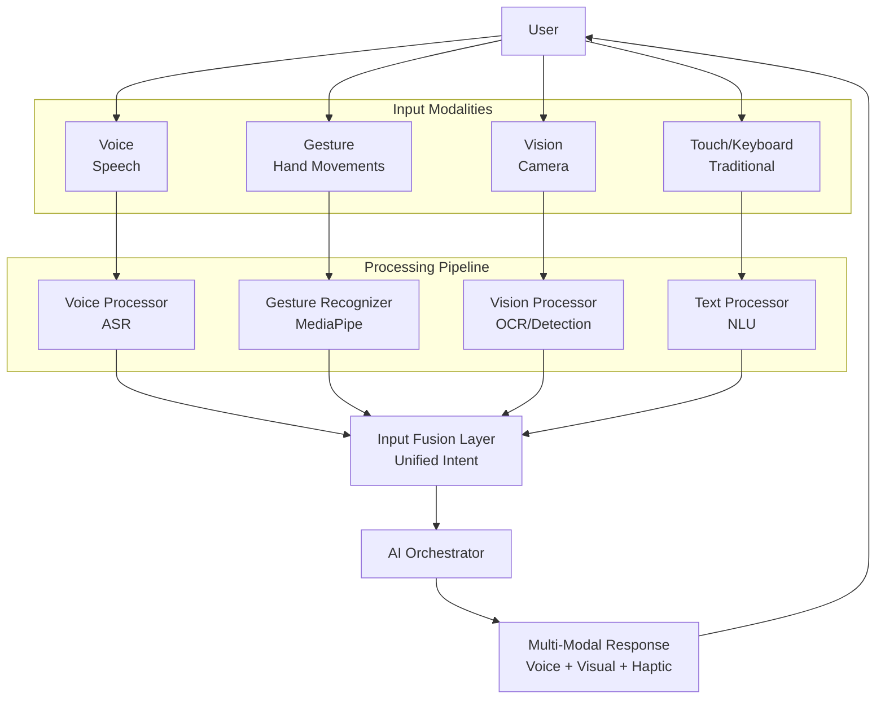
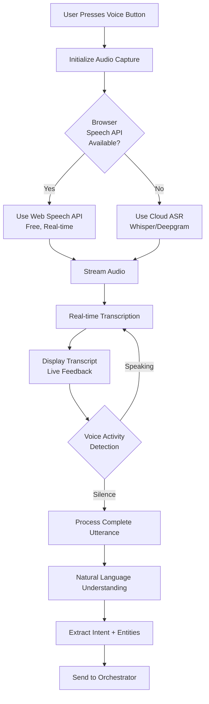
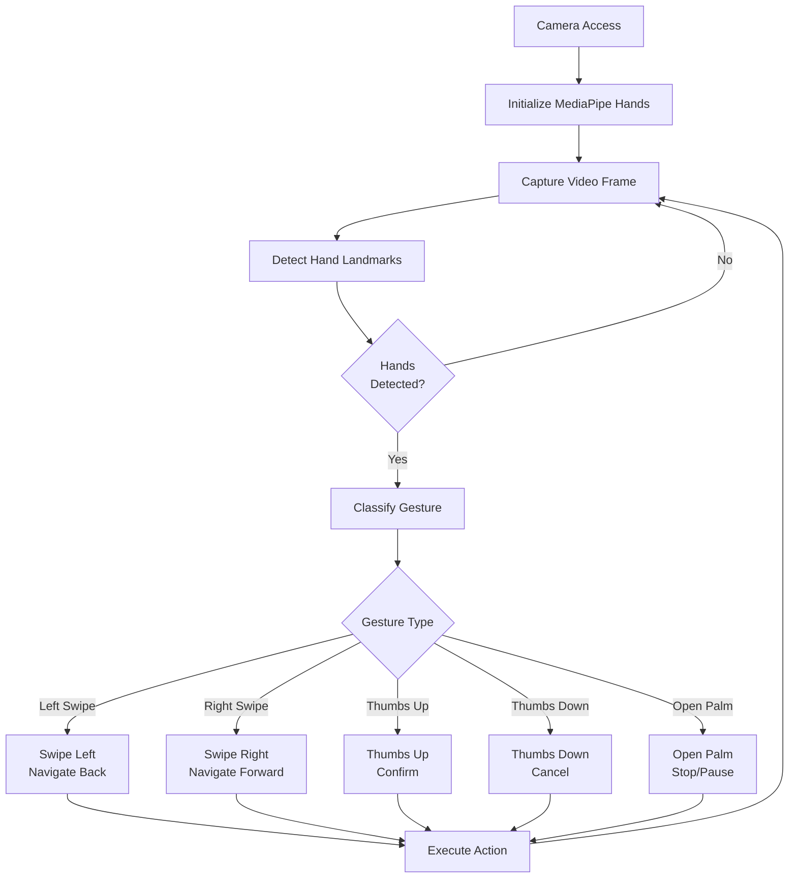
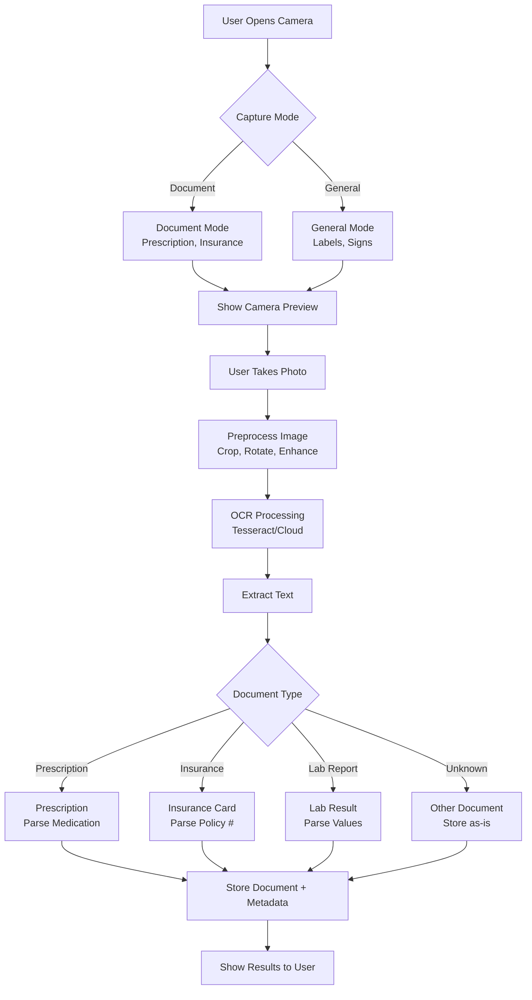

# EcareBots Multi-Modal Processing Pipeline

**Document Version:** 1.0  
**Date:** November 27, 2025  
**Author:** EcareBots Architecture Team  
**Status:** Day 3 Deliverable - Multi-Modal Architecture

---

## Executive Summary

This document specifies the multi-modal input processing architecture for EcareBots, enabling voice, gesture, vision, and touch-based interactions optimized for elderly, disabled, and mobility-challenged users. The design prioritizes accessibility, privacy, and seamless integration with the AI agent system.

**Key Capabilities**:
- **Voice Input**: Browser-based speech recognition + cloud ASR fallback
- **Gesture Recognition**: Hand gestures for basic navigation (future)
- **Vision Processing**: Document scanning with OCR
- **Touch/Keyboard**: Full functionality without voice
- **Unified Processing**: Single pipeline for all input modalities

---

## Table of Contents

1. [Multi-Modal Architecture Overview](#multi-modal-architecture-overview)
2. [Voice Input Pipeline](#voice-input-pipeline)
3. [Gesture Recognition Pipeline](#gesture-recognition-pipeline)
4. [Vision Processing Pipeline](#vision-processing-pipeline)
5. [Input Fusion and Orchestration](#input-fusion-and-orchestration)
6. [Accessibility Considerations](#accessibility-considerations)
7. [Privacy and Security](#privacy-and-security)
8. [Performance Optimization](#performance-optimization)
9. [Future Enhancements](#future-enhancements)

---

## Multi-Modal Architecture Overview

### Input Modalities



### Design Principles

1. **Modality Independence**: Each input works standalone
2. **Graceful Fallback**: Degrade to simpler inputs on failure
3. **Low Latency**: Real-time feedback for all inputs
4. **Privacy-First**: Local processing where possible
5. **Accessibility-Optimized**: Large targets, clear feedback

---

## Voice Input Pipeline

### Voice Architecture



### Technology Selection

#### Primary: Web Speech API

**Pros**:
- Free, no API costs
- Real-time streaming
- Offline capable (some browsers)
- Low latency

**Cons**:
- Browser support varies
- Accuracy lower than cloud
- Limited language models

**Implementation**:
```typescript
class VoiceInputService {
  private recognition: SpeechRecognition;
  
  constructor() {
    const SpeechRecognition = 
      window.SpeechRecognition || window.webkitSpeechRecognition;
    
    this.recognition = new SpeechRecognition();
    this.recognition.continuous = true;
    this.recognition.interimResults = true;
    this.recognition.lang = 'en-US';
  }
  
  startListening(onTranscript: (text: string) => void) {
    this.recognition.onresult = (event) => {
      const results = event.results;
      const lastResult = results[results.length - 1];
      const transcript = lastResult[0].transcript;
      
      if (lastResult.isFinal) {
        onTranscript(transcript);
      }
    };
    
    this.recognition.start();
  }
  
  stopListening() {
    this.recognition.stop();
  }
}
```

#### Fallback: Cloud ASR (Whisper/Deepgram)

**When to Use**:
- Browser API unavailable
- User prefers higher accuracy
- Non-English languages

**Implementation**:
```typescript
class CloudASRService {
  async transcribe(audioBlob: Blob): Promise<string> {
    const formData = new FormData();
    formData.append('audio', audioBlob);
    
    const response = await fetch('/api/transcribe', {
      method: 'POST',
      body: formData
    });
    
    const { transcript } = await response.json();
    return transcript;
  }
}
```

### Voice Activity Detection (VAD)

**Purpose**: Detect when user stops speaking

**Approach**:
1. Monitor audio energy levels
2. Detect silence threshold (e.g., 1.5 seconds)
3. Trigger processing on silence

```typescript
class VADService {
  private silenceThreshold = 1500; // ms
  private silenceTimer: NodeJS.Timeout | null = null;
  
  onAudioData(volume: number, onSilence: () => void) {
    if (volume > 0.01) {
      // Voice detected, reset timer
      if (this.silenceTimer) {
        clearTimeout(this.silenceTimer);
      }
    } else {
      // Silence detected, start timer
      if (!this.silenceTimer) {
        this.silenceTimer = setTimeout(() => {
          onSilence();
          this.silenceTimer = null;
        }, this.silenceThreshold);
      }
    }
  }
}
```

### Voice UI/UX

**Visual Feedback**:
- **Idle**: Microphone icon (gray)
- **Listening**: Pulsing icon (blue)
- **Processing**: Spinner (yellow)
- **Complete**: Checkmark (green)
- **Error**: X icon (red)

**Accessibility**:
- Screen reader announces state changes
- Keyboard shortcut (Space bar) to activate
- Visual transcript display
- Clear error messages

---

## Gesture Recognition Pipeline

### Gesture Architecture (Future Enhancement)



### Technology: MediaPipe Hands

**Why MediaPipe**:
- Runs in browser (TensorFlow.js)
- Real-time performance
- No cloud dependency
- Privacy-preserving

**Gesture Set (Phase 1)**:

| Gesture | Action | Use Case |
|---------|--------|----------|
| Swipe Left | Navigate Back | Return to previous screen |
| Swipe Right | Navigate Forward | Go to next screen |
| Thumbs Up | Confirm | Approve action |
| Thumbs Down | Cancel | Reject action |
| Open Palm | Stop/Pause | Pause voice input |

**Implementation** (Conceptual):
```typescript
import { HandLandmarker } from '@mediapipe/tasks-vision';

class GestureRecognizer {
  private handLandmarker: HandLandmarker;
  
  async initialize() {
    this.handLandmarker = await HandLandmarker.createFromOptions({
      baseOptions: {
        modelAssetPath: '/models/hand_landmarker.task'
      },
      numHands: 2,
      runningMode: 'VIDEO'
    });
  }
  
  async detectGesture(videoFrame: HTMLVideoElement): Promise<string> {
    const results = await this.handLandmarker.detectForVideo(videoFrame);
    
    if (!results.landmarks || results.landmarks.length === 0) {
      return 'none';
    }
    
    const landmarks = results.landmarks[0];
    
    // Thumbs up detection
    if (this.isThumbUp(landmarks)) {
      return 'thumbs_up';
    }
    
    // Swipe detection
    if (this.isSwipeLeft(landmarks)) {
      return 'swipe_left';
    }
    
    return 'unknown';
  }
  
  private isThumbUp(landmarks: any[]): boolean {
    // Thumb tip (4) above thumb IP (3)
    // Other fingers curled
    const thumbTip = landmarks[4];
    const thumbIP = landmarks[3];
    
    return thumbTip.y < thumbIP.y;
  }
}
```

---

## Vision Processing Pipeline

### Vision Architecture



### OCR Technology

#### Primary: Tesseract.js (Browser-based)

**Pros**:
- Runs locally in browser
- Free, no API costs
- Privacy-preserving
- Offline capable

**Cons**:
- Slower than cloud
- Lower accuracy for handwriting

**Implementation**:
```typescript
import Tesseract from 'tesseract.js';

class DocumentScanner {
  async scanDocument(imageBlob: Blob): Promise<string> {
    const { data: { text } } = await Tesseract.recognize(
      imageBlob,
      'eng',
      {
        logger: (m) => console.log(m) // Progress
      }
    );
    
    return text;
  }
}
```

#### Fallback: Cloud OCR (Azure Computer Vision)

**When to Use**:
- Handwritten prescriptions
- Poor image quality
- User requests higher accuracy

**HIPAA Compliance**: Azure CV is HIPAA-compliant with BAA

### Document Classification

**Approach**: Keyword matching + layout analysis

```typescript
class DocumentClassifier {
  classify(text: string, layout: any): string {
    // Prescription keywords
    if (
      text.includes('Rx') ||
      text.includes('Take') ||
      text.includes('mg') ||
      text.includes('refills')
    ) {
      return 'prescription';
    }
    
    // Insurance card keywords
    if (
      text.includes('Member ID') ||
      text.includes('Group #') ||
      text.includes('Rx BIN')
    ) {
      return 'insurance_card';
    }
    
    // Lab result keywords
    if (
      text.includes('Lab Results') ||
      text.includes('Reference Range')
    ) {
      return 'lab_result';
    }
    
    return 'other';
  }
}
```

### Prescription Parsing

**Extract**:
- Medication name
- Dosage (e.g., "10mg")
- Frequency (e.g., "twice daily")
- Prescribing doctor
- Date written
- Refills remaining

**Implementation**:
```typescript
class PrescriptionParser {
  parse(text: string): Prescription {
    // Use regex patterns
    const medicationPattern = /^([A-Z][a-z]+)\s+([0-9]+mg)/;
    const frequencyPattern = /(once|twice|three times)\s+(daily|a day)/;
    
    const medicationMatch = text.match(medicationPattern);
    const frequencyMatch = text.match(frequencyPattern);
    
    return {
      medication: medicationMatch?.[1],
      dosage: medicationMatch?.[2],
      frequency: frequencyMatch?.[0]
    };
  }
}
```

---

## Input Fusion and Orchestration

### Unified Intent Model

**All inputs converge to a single intent structure**:

```typescript
interface UnifiedIntent {
  source: 'voice' | 'gesture' | 'vision' | 'text';
  timestamp: Date;
  
  // Common fields
  action: string;
  entities: Record<string, any>;
  confidence: number;
  
  // Source-specific metadata
  metadata?: {
    // Voice
    transcript?: string;
    audio_duration_ms?: number;
    
    // Gesture
    gesture_type?: string;
    hand_landmarks?: any[];
    
    // Vision
    image_id?: string;
    ocr_text?: string;
    document_type?: string;
  };
}
```

### Fusion Logic

**Multi-Modal Scenarios**:

1. **Voice + Vision**: "This is my prescription" (while showing document)
   - Voice: "upload prescription"
   - Vision: Image of prescription
   - Fusion: Upload document with voice-provided context

2. **Voice + Gesture**: "Do you want to confirm?" → Thumbs up
   - Voice: Question asked
   - Gesture: Thumbs up
   - Fusion: Confirmation action

3. **Text + Vision**: Type "Insurance card" then take photo
   - Text: Document type hint
   - Vision: Image capture
   - Fusion: Classify as insurance card

---

## Accessibility Considerations

### Voice Accessibility

**For Users with Speech Impairments**:
- Adjustable silence threshold
- Manual "stop listening" button
- Alternative text input always available

**For Deaf/Hard-of-Hearing Users**:
- Visual transcript display
- All voice outputs have text alternatives
- Haptic feedback for mobile

### Gesture Accessibility

**For Users with Limited Hand Mobility**:
- Simple, large gestures only
- Long dwell times (2-3 seconds)
- Alternative button controls

### Vision Accessibility

**For Visually Impaired Users**:
- Screen reader announces camera state
- Audio cues for photo capture
- Text-to-speech for OCR results

---

## Privacy and Security

### Voice Privacy

- **No Persistent Recording**: Audio deleted after transcription
- **Opt-in Only**: Users must enable voice explicitly
- **Mute Indicator**: Always-visible recording status

### Gesture Privacy

- **Local Processing**: Never sends video to servers
- **No Frame Storage**: Processed frames discarded immediately
- **Camera Indicator**: OS-level camera-in-use indicator

### Vision Privacy

- **User-Initiated**: Camera only activates on user action
- **Encrypted Storage**: All uploaded images encrypted
- **Retention Policy**: Images deleted after processing (unless user saves)

---

## Performance Optimization

### Voice Performance

| Metric | Target | Optimization |
|--------|--------|-------------|
| Start latency | <300ms | Pre-initialize APIs |
| Transcription latency | <500ms | Use browser API |
| Processing latency | <1s | Async NLU pipeline |

### Gesture Performance

| Metric | Target | Optimization |
|--------|--------|-------------|
| Frame rate | 30 fps | Reduce video resolution |
| Gesture detection | <100ms | Use TensorFlow Lite |
| UI update latency | <50ms | RequestAnimationFrame |

### Vision Performance

| Metric | Target | Optimization |
|--------|--------|-------------|
| OCR processing | <3s | Use Tesseract workers |
| Document upload | <2s | Compress images (JPEG 80%) |
| Classification | <500ms | Rule-based + keywords |

---

## Future Enhancements

### Phase 2: Advanced Voice

- **Speaker Diarization**: Distinguish user vs. caregiver
- **Emotion Detection**: Detect distress in voice tone
- **Multilingual Support**: Support 10+ languages

### Phase 3: Advanced Gesture

- **Facial Expressions**: Yes/no via head nod/shake
- **Eye Gaze Tracking**: Select UI elements with eyes
- **Sign Language Recognition**: Basic ASL support

### Phase 4: Advanced Vision

- **Pill Recognition**: Identify medications from photos
- **Wound Monitoring**: Track healing progress
- **Fall Detection**: Video-based fall alerts

---

## Summary

This multi-modal pipeline provides:

✅ **Voice-first interaction** with browser-based ASR  
✅ **Gesture recognition** for hands-free navigation (future)  
✅ **Document scanning** with local OCR processing  
✅ **Privacy-preserving design** with local-first processing  
✅ **Accessibility-optimized** for diverse user needs  
✅ **Unified intent model** for seamless multi-modal fusion  

This completes the Day 3 architecture documentation.

See also:
- `architecture/system-architecture.md`
- `architecture/ai-agent-design.md`

---

**Document Status**: Complete - Day 3 Deliverable (3/3)  
**Date**: November 27, 2025  
**All Day 3 Deliverables**: ✅ COMPLETE