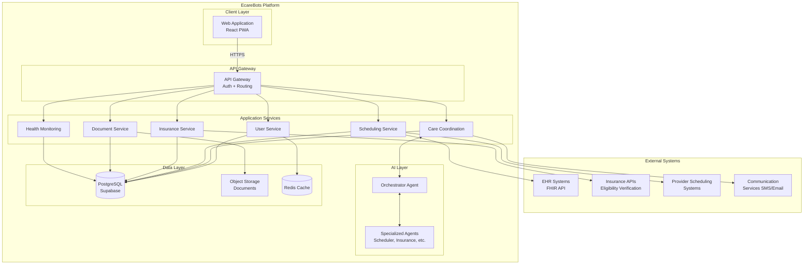
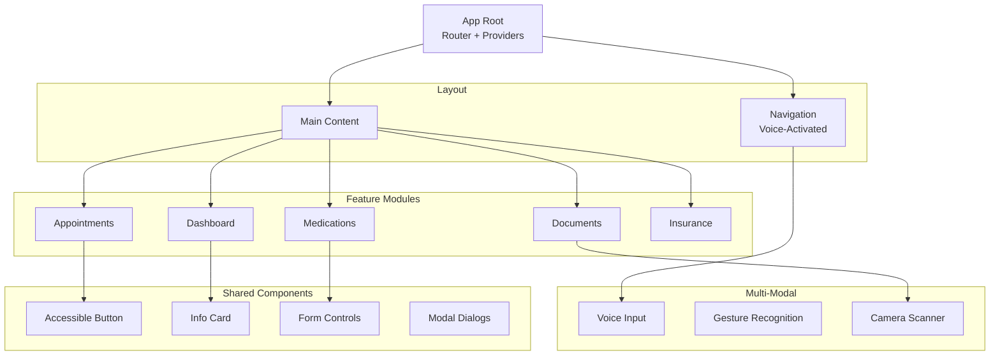
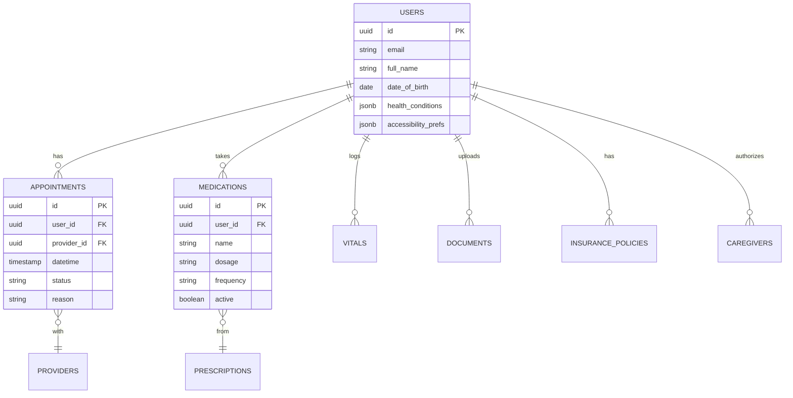
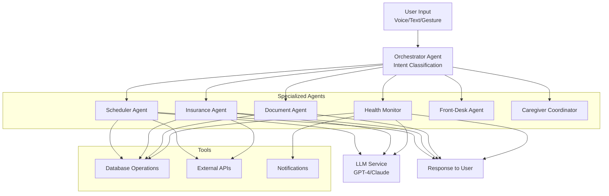
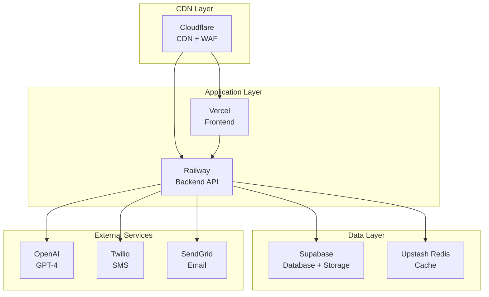
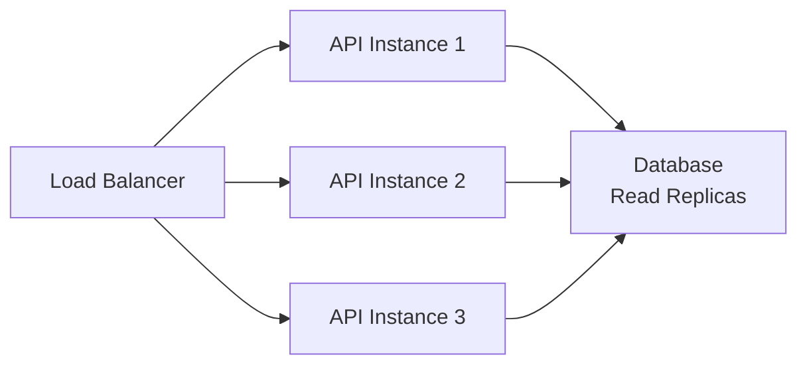

# EcareBots System Architecture

**Document Version:** 1.0  
**Date:** November 27, 2025  
**Author:** EcareBots Architecture Team  
**Status:** Day 3 Deliverable - System Architecture Design

---

## Executive Summary

This document presents the complete system architecture for EcareBots, an AI-powered healthcare coordination platform designed with multi-modal accessibility for elderly, disabled, and mobility-challenged users. The architecture follows a modular monolith approach with clear separation of concerns, enabling scalability, maintainability, and HIPAA-compliant operations.

**Key Architectural Decisions:**
- **Frontend**: React-based progressive web app with WCAG 2.1 AAA compliance
- **Backend**: Node.js/Express modular monolith (scalable to microservices)
- **Database**: Supabase (PostgreSQL) with HIPAA compliance enabled
- **AI Layer**: Custom orchestration with specialized healthcare agents
- **Deployment**: Vercel (frontend) + Railway (backend) + Supabase (database)

---

## Table of Contents

1. [Goals and Principles](#goals-and-principles)
2. [High-Level System Overview](#high-level-system-overview)
3. [Frontend Architecture](#frontend-architecture)
4. [Backend Architecture](#backend-architecture)
5. [Data Layer Architecture](#data-layer-architecture)
6. [AI Orchestration Layer](#ai-orchestration-layer)
7. [Integration Layer](#integration-layer)
8. [Security and Compliance](#security-and-compliance)
9. [Deployment Architecture](#deployment-architecture)
10. [Performance and Scalability](#performance-and-scalability)
11. [Observability](#observability)
12. [Future Extensions](#future-extensions)

---

## Goals and Principles

### Primary Goals

1. **Accessibility-First Healthcare Coordination**
   - Hands-free operation via voice
   - Large touch targets (44x44px minimum)
   - High contrast themes
   - Screen reader compatible

2. **Multi-Modal Input Support**
   - Voice (primary)
   - Touch/keyboard (full functionality)
   - Gesture (future)
   - Camera-based document scanning

3. **HIPAA-Aligned Data Handling**
   - Encryption at rest and in transit
   - Audit logging for PHI access
   - Role-based access control
   - Consent management

4. **Healthcare System Interoperability**
   - FHIR-based data exchange
   - Insurance API integration
   - EHR system connectivity

### Architectural Principles

- **Modular Monolith First**: Start simple, scale later
- **Domain-Driven Design**: Clear bounded contexts
- **API-First**: Backend services expose REST APIs
- **Event-Driven Where Needed**: Async processing for long-running tasks
- **Fail-Safe Degradation**: Core features work without AI
- **Explainable AI Actions**: All AI decisions are auditable

---

## High-Level System Overview

### System Context Diagram



---

## Frontend Architecture

### Technology Stack

**Selected**: React 18+ with TypeScript

**Rationale**:
- Strong accessibility ecosystem (React-ARIA, Radix UI)
- Mature testing tools (Jest, React Testing Library)
- Large community and healthcare industry adoption
- TypeScript for type-safe healthcare data handling

### Component Architecture



### Accessibility Implementation

**WCAG 2.1 AAA Targets**:

- **Perceivable**:
  - High contrast mode (7:1 ratio minimum)
  - Text alternatives for all images
  - Captions for audio/video

- **Operable**:
  - Keyboard navigation for all features
  - No time limits on interactions
  - Clear focus indicators
  - Large touch targets (44x44px)

- **Understandable**:
  - Simple language (6th grade reading level)
  - Consistent navigation
  - Error prevention and clear error messages

- **Robust**:
  - Semantic HTML
  - ARIA landmarks and roles
  - Compatible with assistive technologies

---

## Backend Architecture

### Modular Monolith Structure

```
backend/
├── src/
│   ├── modules/
│   │   ├── auth/              # Authentication & authorization
│   │   ├── users/             # User management
│   │   ├── care/              # Care coordination
│   │   ├── scheduling/        # Appointment scheduling
│   │   ├── insurance/         # Insurance verification
│   │   ├── documents/         # Document management
│   │   ├── health/            # Health monitoring
│   │   └── ai/                # AI orchestration
│   ├── shared/
│   │   ├── database/          # DB client
│   │   ├── cache/             # Redis client
│   │   ├── middleware/        # Express middleware
│   │   └── utils/             # Utilities
│   └── index.ts               # App entry
├── tests/
└── package.json
```

### Domain Services

**User Service**:
- User account management
- Caregiver relationships
- Accessibility preferences
- Privacy settings

**Care Coordination Service**:
- Central hub for care activities
- AI orchestrator integration
- Task management
- Reminders

**Scheduling Service**:
- Appointment CRUD
- Provider availability
- Calendar integration
- Reminder notifications

**Insurance Service**:
- Policy management
- Coverage verification
- Claims tracking
- Cost estimation

**Document Service**:
- Upload/download
- OCR processing
- Metadata extraction
- Expiry tracking

**Health Monitoring Service**:
- Vitals logging
- Medication tracking
- Trend analysis
- Alert generation

---

## Data Layer Architecture

### Database: PostgreSQL (Supabase)

**Key Features**:
- Row-Level Security (RLS) for multi-tenancy
- Real-time subscriptions
- Built-in authentication
- HIPAA-compliant tier available

### Core Entities



### Object Storage

**Supabase Storage**:
- Medical documents (PDF, images)
- Audio recordings (with consent)
- Profile photos

**Security**:
- Pre-signed URLs for access
- Automatic encryption at rest
- Access logging

---

## AI Orchestration Layer

### Architecture Overview



### Integration Pattern

1. **User Request** → Care Coordination Service
2. **Service** calls AI Orchestrator with context
3. **Orchestrator** classifies intent, routes to agent
4. **Agent** uses tools (DB queries, API calls)
5. **Agent** returns structured results
6. **Service** processes results, updates state
7. **Response** sent to user

---

## Integration Layer

### FHIR/HL7 Integration

**FHIR Resources Used**:
- Patient
- Appointment
- Observation (vitals)
- MedicationStatement
- DocumentReference

**Integration Pattern**:
```typescript
interface FHIRAdapter {
  mapToFHIR(internalModel: any): FHIRResource;
  mapFromFHIR(fhirResource: FHIRResource): InternalModel;
  syncWithEHR(patientId: string): Promise<void>;
}
```

### Insurance APIs

**Capabilities**:
- Eligibility verification
- Coverage details
- Benefits inquiry
- Claims status

**Error Handling**:
- Retry with exponential backoff
- Fallback to cached data
- User notification on failure

---

## Security and Compliance

### HIPAA-Aligned Patterns

**Data Encryption**:
- TLS 1.3 for transit
- AES-256 for rest
- Database-level encryption

**Access Control**:
- Role-based permissions
- Resource-level ownership checks
- MFA for sensitive operations

**Audit Logging**:
```typescript
interface AuditLog {
  timestamp: Date;
  userId: string;
  action: string;
  resourceType: string;
  resourceId: string;
  ipAddress: string;
  userAgent: string;
  outcome: 'success' | 'failure';
}
```

**Consent Management**:
- Explicit consent for data sharing
- Granular caregiver permissions
- Consent revocation tracking

---

## Deployment Architecture

### Infrastructure



### CI/CD Pipeline

**GitHub Actions**:

```yaml
name: Deploy
on:
  push:
    branches: [main]

jobs:
  test:
    runs-on: ubuntu-latest
    steps:
      - uses: actions/checkout@v3
      - run: npm test
  
  deploy-frontend:
    needs: test
    runs-on: ubuntu-latest
    steps:
      - uses: vercel-action@v1
        with:
          vercel-token: ${{ secrets.VERCEL_TOKEN }}
  
  deploy-backend:
    needs: test
    runs-on: ubuntu-latest
    steps:
      - uses: railway-deploy@v1
        with:
          token: ${{ secrets.RAILWAY_TOKEN }}
```

### Cost Estimation

| Service | Tier | Monthly Cost |
|---------|------|-------------|
| Vercel | Pro | $20 |
| Railway | Pro | $20 |
| Supabase | Pro (HIPAA) | $25 |
| Upstash Redis | Pay-as-you-go | $5 |
| OpenAI API | Usage-based | ~$50 |
| Twilio | Pay-as-you-go | $20 |
| SendGrid | Free tier | $0 |
| **Total** | | **~$140/month** |

---

## Performance and Scalability

### Performance Targets

| Metric | MVP | Production |
|--------|-----|------------|
| API Response (p95) | <500ms | <300ms |
| AI Response (p95) | <3s | <2s |
| Page Load | <2s | <1.5s |
| Concurrent Users | 100 | 1,000+ |

### Scaling Strategy

**Horizontal Scaling**:


**Database Optimization**:
- Connection pooling
- Query optimization
- Proper indexing
- Read replicas for queries

---

## Observability

### Logging

**Structured Logs**:
```typescript
logger.info({
  event: 'appointment_created',
  userId: user.id,
  appointmentId: appointment.id,
  providerId: provider.id,
  timestamp: new Date()
});
```

### Metrics

**Key Metrics**:
- Request rate
- Error rate
- Response time (p50, p95, p99)
- AI agent invocations
- Database query performance

**Tools**: Prometheus + Grafana

### Tracing

**Distributed Tracing**:
- Trace ID propagation
- Span creation for:
  - API requests
  - Database queries
  - External API calls
  - AI agent invocations

**Tool**: OpenTelemetry

---

## Future Extensions

### Phase 2 Enhancements

1. **Native Mobile Apps**
   - iOS/Android wrappers
   - Deeper OS integration
   - Offline-first capabilities

2. **Advanced Gesture Recognition**
   - Hand gestures for navigation
   - Facial expression for quick responses
   - Eye tracking for accessibility

3. **Smart Speaker Integration**
   - Alexa/Google Home skills
   - Voice-only interactions
   - Reminder broadcasts

4. **Wearable Device Integration**
   - Apple Health/Google Fit
   - Continuous vitals monitoring
   - Activity tracking

5. **Telehealth Integration**
   - Video consultation scheduling
   - In-app video calls
   - Screen sharing for document review

---

## Summary

This architecture provides:

✅ **Accessibility-first design** with multi-modal input support  
✅ **Modular, scalable backend** with clear domain boundaries  
✅ **HIPAA-aligned security** with encryption and audit logging  
✅ **AI orchestration** through specialized healthcare agents  
✅ **Healthcare interoperability** via FHIR/HL7 integration  
✅ **Production-ready deployment** with CI/CD and observability  

Detailed specifications for AI agents and multi-modal processing are in:
- `architecture/ai-agent-design.md`
- `architecture/multimodal-pipeline.md`

---

**Document Status**: Complete - Day 3 Deliverable (1/3)  
**Date**: November 27, 2025  
**Next**: AI Agent Design Documentation