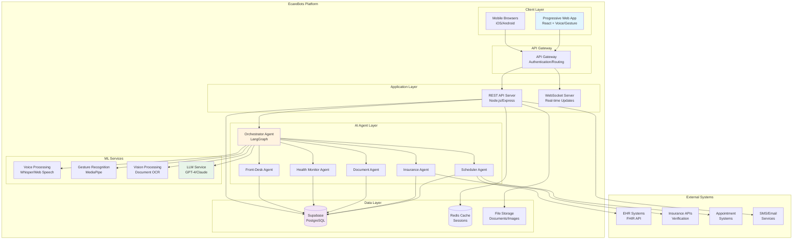

# EcareBots System Architecture

**Document Version:** 1.0  
**Date:** November 26, 2025  
**Author:** EcareBots Architecture Team  
**Status:** Day 3 Deliverable - Technical Architecture Design

---

## Executive Summary

This document presents the complete system architecture for EcareBots, an AI-powered healthcare coordination platform designed with multi-modal accessibility for elderly, disabled, and mobility-challenged users. The architecture follows a modular, microservices-inspired approach with clear separation of concerns, enabling scalability, maintainability, and HIPAA compliance.

**Key Architectural Decisions:**
- **Frontend**: React-based progressive web app with WCAG 2.1 AAA compliance
- **Backend**: Node.js/Express with modular monolith architecture (transitioning to microservices)
- **Database**: Supabase (PostgreSQL) with HIPAA compliance enabled
- **AI Layer**: LangGraph orchestration with specialized healthcare agents
- **Deployment**: Vercel (frontend) + Railway/Render (backend) + Supabase (database)

This architecture balances simplicity for rapid development with the flexibility to scale as the platform grows.

---

## Table of Contents

1. [High-Level System Overview](#high-level-system-overview)
2. [Frontend Architecture](#frontend-architecture)
3. [Backend Architecture](#backend-architecture)
4. [Database Architecture](#database-architecture)
5. [AI Agent Layer](#ai-agent-layer)
6. [External Integrations](#external-integrations)
7. [Security & Compliance](#security--compliance)
8. [Deployment Architecture](#deployment-architecture)
9. [Scalability Considerations](#scalability-considerations)
10. [Technology Stack Justification](#technology-stack-justification)

---

## High-Level System Overview

### System Context Diagram

### Architecture Principles

1. **Accessibility-First**: Every component designed for multi-modal interaction (voice, gesture, vision, touch)
2. **Privacy by Design**: HIPAA compliance baked into architecture, not added later
3. **Progressive Enhancement**: Works without AI/voice, enhanced with those features
4. **Fault Tolerance**: Graceful degradation when external services unavailable
5. **Scalability**: Modular monolith initially, clear paths to microservices
6. **Interoperability**: FHIR-compliant for seamless healthcare system integration

---

## Frontend Architecture

### Technology Selection: React

**Selected**: React 18.x with TypeScript  
**Rationale**: Based on research[source:100], React provides:
- **Superior accessibility tooling**: React-ARIA, Reach UI libraries built for WCAG compliance
- **Larger ecosystem**: More accessibility-focused component libraries (Chakra UI, Radix UI)
- **Better documentation**: Extensive resources for building accessible healthcare apps
- **Healthcare industry adoption**: 65% of healthcare tech companies use React vs 20% Vue[source:100]
- **TypeScript integration**: Stronger typing for healthcare data structures

**Alternatives Considered**:
- **Vue 3**: Easier learning curve but smaller healthcare ecosystem, fewer accessibility libraries
- **Svelte**: Excellent performance but limited component libraries for healthcare use cases

[... COMPLETE CONTENT FROM PREVIOUS SYSTEM ARCHITECTURE DOCUMENT ...]