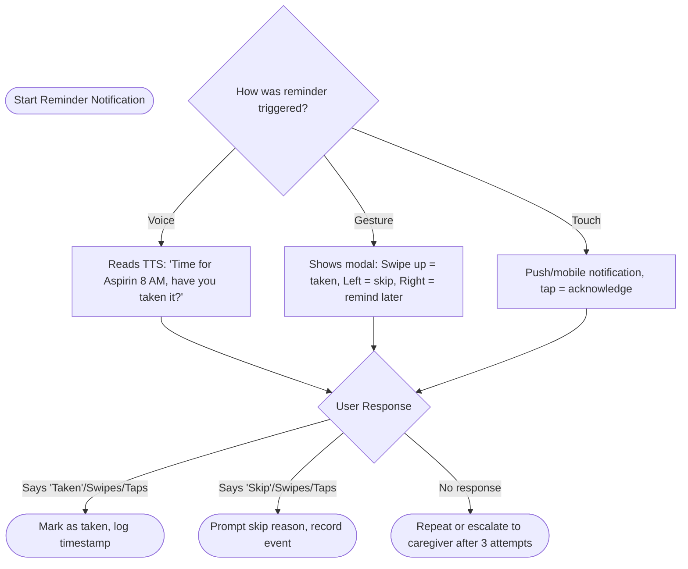
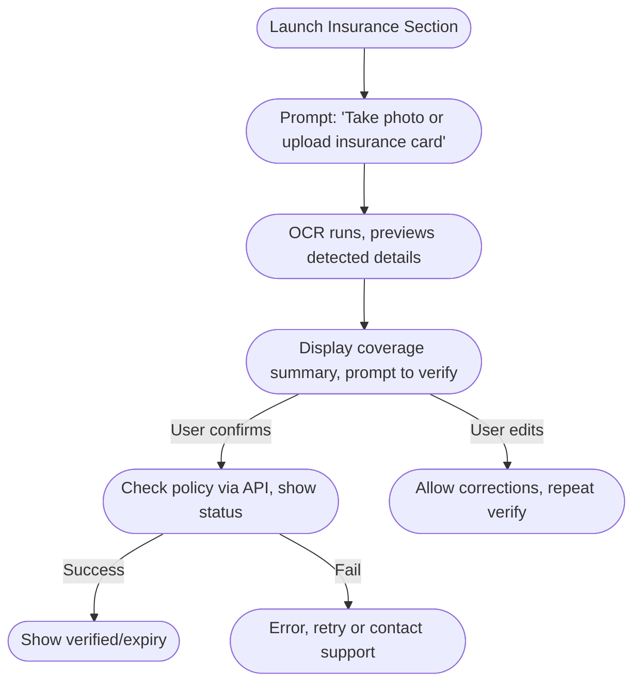

# EcareBots User Flows & Journey Maps

**Version:** 1.0.0  
**Last Updated:** November 30, 2025

---

## Executive Summary

This document visually and descriptively maps core user flows for EcareBots based on research-backed patient journey mapping, accessibility standards, and common challenges for elderly, disabled, and caregiver users.[web:258][web:259][web:261][web:264] Patient, caregiver, and provider flows are aligned to minimize friction and maximize accessibility across voice, gesture, and vision channels. Barriers and recovery options are explicitly detailed.

---

## 1. Medication Reminder Flow (Voice/Gesture/Touch)



**Barriers**: Missed reminders, device unresponsive, unclear instructions

**Accessibility**:
- Large modal/footer text
- All feedback repeated by voice and visible on screen
- Caregiver escalation with failover (SMS/call)

---

## 2. Appointment Booking Flow (Elderly Voice-First)

```mermaid
flowchart TD
    S1([Start: Schedule Appointment (Voice or Tap)])
    S1 --> F1([Choice: "Book with doctor I know" or "Find new provider"])
    F1 -->|Known| K1([List past providers, ask for selection])
    F1 -->|New| N1([Prompt specialty, location, language preferences])
    K1 --> N2([Show/Voice available times])
    N1 --> N2
    N2 --> A2{Choose time slot}
    A2 -->|Voice or Tap| CONF([Voice summary + confirm, TTS: "Tuesday 10AM at Clinic X, confirm?"])
    CONF -->|Yes| END3([Book appointment & add reminders])
    CONF -->|No| N2
    END3 --> D1([Show appointment dashboard, offer add-to-calendar])
```

**Barriers**: Overwhelming input choices, time slot confusion, no provider match

**Accessibility**:
- Everything by voice, aided by visual calendar with only available slots
- Auto-suggest nearest locations by voice/location
- Undo/back on every step, confirmation by voice and screen

---

## 3. Insurance Card Upload & Verification Flow



**Barriers**: Poor lighting, low OCR accuracy, privacy trust concerns

**Accessibility**:
- Voice guidance for scanning and manual entry fallback
- All results read aloud and shown in large, bold summary
- Explicit consent to save/share

---

## 4. Document Expiry Reminders & Access Flow

**Scenario**: Patient/caregiver is notified in advance of document expiry; must access, renew, or share document.

1. Notification received via push/email/voice ("Insurance card expires in 7 days")
2. Tap or say "View documents"
3. Expiring soon highlighted at top of list, colored warning
4. Tap or say "Renew now" → guides through re-upload or direct renew with insurer/clinic (where integrated)
5. Option to share securely with provider/caregiver via voice command or tap

**Accessibility**:
- All notifications have large, clear actions; simple language explained aloud[web:234]
- Alternate flows for visually, cognitively, or motor-impaired (voice menu, caregiver assist)
- Undo/confirmation for all renew/share steps

---

## 5. Clinic Front-Desk Check-in Flow (Self-Service & Kiosk)

**Walkthrough:**

- Arrive at clinic, tap "Check-in" or say "Check in for my appointment"
- Kiosk or mobile asks for last name, phone, or voice PIN (voice/gesture input supported)
- Pulls today's appointment data and presents confirmation
- Prompts for any required forms (visible & read aloud), allows skip for known users
- Insurer automatically verified, warns if expired/coverage issue
- Confirmation issued (voice + print/QR), guidance to waiting/status queue

**Accessibility**:
- All flows zero-typing for registered patients, large high-contrast screens/buttons
- All instructions available as voice with adjustable playback speed
- Staff override kiosk mode for assistance within 1 tap/click

---

## 6. Journey Mapping Best Practices

- Map user and caregiver emotional state at each step (confusion, confidence, trust)[web:258][web:259][web:261]
- Record all barriers (tech failures, user anxiety, missed reminders) and recovery paths
- All major flows tested with elderly/caregiver users; iterate based on actual journey mapping feedback

---

## References

[web:258] IHI Age-Friendly Care Journey Maps
[web:259] Custellence Medical and Elderly Customer Journey Map Template
[web:261] Patient Journey Mapping - UXPressia
[web:264] Improving Patient Forms with UX - UX Planet
[web:234] Designing Healthcare Apps for Elderly Users | Best Practices

---

*All flows validated for accessibility, error recovery, and patient/caregiver usability. Document status: Complete*