# EcareBots User Flows & Journey Maps

**Version:** 2.0.0 (Enhanced with detailed diagrams)  
**Last Updated:** December 14, 2025

---

## Executive Summary

This document visually and descriptively maps core user flows for EcareBots based on research-backed patient journey mapping, accessibility standards, and common challenges for elderly, disabled, and caregiver users. Patient, caregiver, and provider flows are aligned to minimize friction and maximize accessibility across voice, gesture, and vision channels. Barriers and recovery options are explicitly detailed.

---

## **Table of Contents**

1. [Voice-First Interaction Flow](#voice-first-interaction-flow)
2. [Medication Management Flow](#medication-management-flow)
3. [Appointment Booking Flow](#appointment-booking-flow)
4. [Insurance Verification Flow](#insurance-verification-flow)
5. [Document Management Flow](#document-management-flow)
6. [Clinic Check-in Flow](#clinic-check-in-flow)
7. [Error Recovery Flows](#error-recovery-flows)
8. [Accessibility Design Patterns](#accessibility-design-patterns)

---

## **Voice-First Interaction Flow**

### Core Voice Command Processing

```mermaid
graph TD
    A([User Speaks Command]) --> B["🎤 Speech-to-Text<br/>(Whisper API)"]
    B --> C{Intent<br/>Recognition}
    C -->|Schedule| D["Scheduler Agent"]
    C -->|Insurance| E["Insurance Agent"]
    C -->|Medication| F["Medication Agent"]
    C -->|Document| G["Document Agent"]
    C -->|Unclear| H["Ask for Clarification"]
    
    D --> I["Process & Verify"]
    E --> I
    F --> I
    G --> I
    H --> J{"Try Again?"}
    J -->|Yes| A
    J -->|No| K["Offer Human Support"]
    
    I --> L{"Requires<br/>Confirmation?"}
    L -->|Yes| M["Voice Summary +<br/>Confirm Yes/No"]
    L -->|No| N["Execute Action"]
    
    M -->|Confirmed| N
    M -->|Denied| O["Ask to Rephrase"]
    O --> A
    
    N --> P["🔊 Text-to-Speech<br/>Confirmation"]
    P --> Q([Action Complete])
    K --> Q
```



**Features:**
- Always provide voice summary before action
- Support natural language variations
- Offer back/undo options
- Default to voice output (no reading required)

---

## **Medication Management Flow**

### Medication Reminder Workflow

```mermaid
graph TD
    START([Reminder Time Reached]) --> CALC["Calculate<br/>Reminder<br/>Timing"]
    CALC --> NOTIFY{"Delivery<br/>Method"}
    
    NOTIFY -->|Voice| V1["🎤 Play TTS:<br/>'Time for Aspirin<br/>8 AM. Have you<br/>taken it?'"]
    NOTIFY -->|SMS| V2["📱 Send SMS + Link"]
    NOTIFY -->|Push| V3["📲 Push Notification"]
    
    V1 --> RESPONSE{"User<br/>Response"}
    V2 --> RESPONSE
    V3 --> RESPONSE
    
    RESPONSE -->|"Says 'Yes' or<br/>Gesture: Thumbs Up<br/>or Tap Confirm"| CONFIRM["✅ Log: Taken"]
    RESPONSE -->|"Says 'Skip' or<br/>Gesture: Swipe Left<br/>or Tap Skip"| SKIP["⏭️ Log: Skipped<br/>Ask Reason"]
    RESPONSE -->|"No response<br/>after 3 min"| RETRY1["Retry #1<br/>- 2 mins later"]
    
    RETRY1 --> RESPONSE2{"Response?"}
    RESPONSE2 -->|Yes| CONFIRM
    RESPONSE2 -->|No| RETRY2["Retry #2<br/>- 5 mins later"]
    
    RETRY2 --> RESPONSE3{"Response?"}
    RESPONSE3 -->|Yes| CONFIRM
    RESPONSE3 -->|No| ESCALATE["📞 Alert Caregiver<br/>via Voice Call"]
    
    SKIP --> REASON["Ask: 'Why skipped?'<br/>- Side effects<br/>- Already took<br/>- Forgot why"]
    REASON --> LOG1["Log: Reason + Time"]
    
    CONFIRM --> VISUAL["📱 Display:<br/>✅ Confirmed<br/>Next dose: 6 PM"]
    LOG1 --> VISUAL
    ESCALATE --> CAREGIVER["💬 Caregiver<br/>Confirms or<br/>Override"]
    CAREGIVER --> VISUAL
    
    VISUAL --> END([Medication Tracked])
```



### Medication Refill Request

```mermaid
graph TD
    USER([User: "I need<br/>a refill"]) --> DETECT["Agent detects:<br/>Request to refill<br/>medication"]
    DETECT --> SEARCH["Query active<br/>medications"]
    SEARCH --> SHOW{"How many<br/>active meds?"}
    
    SHOW -->|1| SINGLE["Display: 'Aspirin'"]
    SHOW -->|2-5| MULTIPLE["🎤 List options,<br/>ask which one"]
    SHOW -->|0| NONE["No active meds<br/>found. Contact<br/>doctor?"]
    
    SINGLE --> CHECK["Check:<br/>- Refills remaining<br/>- Last refill date<br/>- Expiry status"]
    MULTIPLE --> SELECTION{"User<br/>selects"}
    NONE --> CONTACT
    
    SELECTION --> CHECK
    
    CHECK --> STATUS{"Can<br/>Refill?"}
    STATUS -->|Yes, has refills| SUBMIT["📤 Submit refill<br/>request to pharmacy"]
    STATUS -->|No refills| CONTACT["💬 Contact doctor<br/>for new prescription"]
    STATUS -->|Expired| EXPIRED["❌ Prescription<br/>expired. Contact<br/>doctor."]
    
    SUBMIT --> CONFIRM_PHARMACY["Pharmacy confirms<br/>or requests info"]
    CONFIRM_PHARMACY --> READY{"Ready?"}
    READY -->|Yes| PICKUP["✅ Ready for pickup<br/>at [Pharmacy]<br/>Address & Hours"]
    READY -->|No| WAIT["⏳ Estimated ready:<br/>24 hours"]
    
    PICKUP --> REMINDER["🔔 Set reminder<br/>to pick up"]
    WAIT --> REMINDER
    REMINDER --> END([Refill Arranged])
    CONTACT --> END
    EXPIRED --> END
```

---

## **Appointment Booking Flow**

### Voice-First Appointment Scheduling

```mermaid
graph TD
    START([User: "Schedule<br/>appointment"]) --> INTENT["Agent recognizes:<br/>Appointment request"]
    INTENT --> GATHER{"Known<br/>doctor?"}
    
    GATHER -->|"Yes: 'See Dr. Smith'"| KNOWN["Display: Dr. Smith's<br/>recent appointments<br/>& available slots"]
    GATHER -->|"No: 'Need cardiologist'"| NEW["🔍 Ask:<br/>- Specialty<br/>- Location<br/>- Insurance"]
    GATHER -->|"Unsure"| HELP["Help finding<br/>right provider"]
    
    NEW --> SEARCH["Search in-network<br/>providers matching<br/>criteria"]
    HELP --> SEARCH
    
    SEARCH --> RESULTS{"Providers<br/>found?"}
    RESULTS -->|Yes| LIST["List top 3<br/>providers with<br/>ratings"]
    RESULTS -->|No| NO_RESULTS["❌ No providers<br/>found. Try:<br/>- Different location<br/>- Different specialty"]
    
    KNOWN --> AVAIL["📅 Check availability<br/>via EHR API"]
    LIST --> AVAIL
    NO_RESULTS --> START
    
    AVAIL --> SLOTS{"Slots<br/>available?"}
    SLOTS -->|Yes| DISPLAY["🎤 Read aloud:<br/>'Available times:<br/>Tuesday 10 AM,<br/>Tuesday 2 PM,<br/>Wednesday 9 AM'"]
    SLOTS -->|No| WAITLIST["Offer waitlist<br/>or alternative times"]
    
    DISPLAY --> SELECT["User says:<br/>'Tuesday 10 AM'"]
    WAITLIST --> WAIT_CONFIRM["Add to waitlist?"]
    
    SELECT --> DETAILS["Extract details:<br/>- Provider<br/>- Date<br/>- Time<br/>- Reason (if new)"]
    WAIT_CONFIRM --> DETAILS
    
    DETAILS --> VERIFY["🎤 Voice Summary:<br/>'Tuesday Jan 20<br/>10 AM with<br/>Dr. Smith at<br/>Heart Center.<br/>Is this correct?'"]
    
    VERIFY --> CONFIRM{"User<br/>confirms?"}
    CONFIRM -->|"Yes"| BOOK["📤 Submit booking<br/>via EHR"]
    CONFIRM -->|"No"| MODIFY{"Change what?<br/>- Time<br/>- Provider<br/>- Start over"}
    
    MODIFY -->|Time| AVAIL
    MODIFY -->|Provider| GATHER
    MODIFY -->|Start| START
    
    BOOK --> CHECK_EHR{"Booking<br/>success?"}
    CHECK_EHR -->|Yes| SUCCESS["✅ Appointment<br/>Confirmed"]
    CHECK_EHR -->|No| ERROR["❌ Booking failed.<br/>Retry?"]
    
    SUCCESS --> DETAILS_DISPLAY["📱 Display + Voice:r/>- Confirmation #<br/>- Address<br/>- Directions<br/>- Parking info<br/>- Required docs"]
    DETAILS_DISPLAY --> REMINDER_SET["🔔 Set reminders:<br/>- 1 week before<br/>- 1 day before<br/>- 1 hour before"]
    
    REMINDER_SET --> ADD_CALENDAR["Add to calendar?<br/>(optional)"]
    ADD_CALENDAR --> END([Appointment Scheduled])
    ERROR --> BOOK
```

---

## **Insurance Verification Flow**

### Real-Time Insurance Check

```mermaid
graph TD
    START([User: "Check my<br/>insurance"]) --> INPUT{"Provide info<br/>how?"}
    
    INPUT -->|Voice| VOICE["🎤 Say: Insurance<br/>member number<br/>and DOB"]
    INPUT -->|Photo| PHOTO["📸 Take picture<br/>of insurance card"]
    INPUT -->|Manual| MANUAL["⌨️ Type or<br/>paste numbers"]
    
    VOICE --> VOICE_IN["Speech-to-text:<br/>Extract member ID<br/>& DOB"]
    PHOTO --> OCR["Run OCR on card<br/>image"]
    MANUAL --> MANUAL_IN["Parse entered<br/>data"]
    
    VOICE_IN --> VERIFY_INPUT["Confirm with user:<br/>'Member ID: 123...<br/>Is that correct?'"]
    OCR --> OCR_RESULT{"OCR<br/>successful?"}
    MANUAL_IN --> VERIFY_INPUT
    
    OCR_RESULT -->|Good| OCR_DISPLAY["Display detected<br/>info for review<br/>& editing"]
    OCR_RESULT -->|Poor| OCR_MANUAL["Fall back to<br/>manual entry"]
    
    OCR_DISPLAY --> VERIFY_INPUT
    OCR_MANUAL --> MANUAL
    
    VERIFY_INPUT --> CONFIRM{"Correct?"}
    CONFIRM -->|No| EDIT["User corrects<br/>info"]
    EDIT --> VERIFY_INPUT
    
    CONFIRM -->|Yes| QUERY["📡 Query Availity API<br/>with member info"]
    
    QUERY --> RESPONSE{"API<br/>response?"}
    RESPONSE -->|Success| PARSE["Parse eligibility<br/>data"]
    RESPONSE -->|Error| RETRY["Retry API call<br/>or contact<br/>support"]
    
    PARSE --> EXTRACT["Extract key info:<br/>- Eligible: Yes/No<br/>- Copay: $20-50<br/>- Deductible: $1000<br/>- Out-of-pocket: $5000<br/>- In-network: Yes/No"]
    
    EXTRACT --> DISPLAY["📱 Display + Voice:r/>✅ ELIGIBLE<br/>Copay: $25<br/>Deductible: $500<br/>Deductible met: $300<br/>(60%)"]
    
    DISPLAY --> STATUS{"Other<br/>options?"}
    STATUS -->|Check coverage| COVERAGE["Search specific<br/>procedure/provider<br/>coverage"]
    STATUS -->|Find provider| FIND_PROV["Search in-network<br/>providers"]
    STATUS -->|Done| END([Insurance Info<br/>Retrieved])
    
    COVERAGE --> COV_QUERY["Check if specific<br/>CPT code covered"]
    COV_QUERY --> COV_RESULT["Display coverage<br/>details & costs"]
    COV_RESULT --> END
    
    FIND_PROV --> SPEC["Specialty?"]
    SPEC --> ZIP["Location (ZIP)?"]
    ZIP --> SEARCH["Search network"]
    SEARCH --> PROV_LIST["Display providers<br/>with ratings"]
    PROV_LIST --> END
```

---

## **Document Management Flow**

### Upload, Track, and Renew Documents

```mermaid
graph TD
    START([Documents Section]) --> VIEW["📄 Show documents:<br/>- Insurance card<br/>- Prescriptions<br/>- Medical records"]
    
    VIEW --> STATUS{"Document<br/>Status"}
    STATUS -->|Expires soon| EXPIRING["🟡 'Insurance<br/>expires in 7 days'"]
    STATUS -->|Valid| VALID["✅ Valid<br/>Expires: Dec 2026"]
    STATUS -->|Expired| EXPIRED["🔴 EXPIRED<br/>Renew now"]
    
    EXPIRING --> ACTION{"User<br/>action?"}
    VALID --> ACTION
    EXPIRED --> ACTION
    
    ACTION -->|Renew| RENEW_METHOD{"How to<br/>renew?"}
    ACTION -->|Share| SHARE_FLOW["Share with provider<br/>or caregiver"]
    ACTION -->|Delete| DELETE["Delete document<br/>(with confirmation)"]
    ACTION -->|Nothing| END([Exit])
    
    RENEW_METHOD -->|Auto| AUTO["Attempt auto-renew<br/>with insurance<br/>company"]
    RENEW_METHOD -->|Upload new| UPLOAD["📸 Upload new card<br/>photo"]
    RENEW_METHOD -->|Manual| MANUAL["Manually enter<br/>policy details"]
    
    AUTO --> AUTO_CHECK{"Success?"}
    AUTO_CHECK -->|Yes| AUTO_SUCCESS["✅ Renewed automatically"]
    AUTO_CHECK -->|No| UPLOAD
    
    UPLOAD --> OCR["Run OCR<br/>on image"]
    OCR --> OCR_VERIFY["Confirm extracted<br/>data with user"]
    OCR_VERIFY --> SAVE_NEW["💾 Save new<br/>document"]
    
    MANUAL --> FORM["Fill form:<br/>- Policy number<br/>- Group number<br/>- Effective date<br/>- Expiry date"]
    FORM --> SAVE_NEW
    
    AUTO_SUCCESS --> SUCCESS["✅ Document<br/>Updated"]
    SAVE_NEW --> SUCCESS
    
    SHARE_FLOW --> SHARE_TO{"Share<br/>with?"}
    SHARE_TO -->|Provider| PROVIDER_SHARE["Send secure link<br/>to provider portal"]
    SHARE_TO -->|Caregiver| CARE_SHARE["📱 SMS/email to<br/>caregiver"]
    SHARE_TO -->|Print| PRINT["🖨️ Print copy<br/>for appointment"]
    
    PROVIDER_SHARE --> PROV_CONFIRM["Confirm sent to<br/>Dr. Smith"]
    CARE_SHARE --> CARE_CONFIRM["Confirm sent to<br/>Jane Doe"]
    PRINT --> PRINT_CONFIRM["Print ready at<br/>home printer"]
    
    PROV_CONFIRM --> END
    CARE_CONFIRM --> END
    PRINT_CONFIRM --> END
    DELETE --> END
    SUCCESS --> END
```



---

## **Clinic Check-in Flow**

### Self-Service Kiosk or Mobile Check-in

```mermaid
graph TD
    ARRIVE([Patient arrives<br/>at clinic]) --> KIOSK{"Check-in<br/>method?"}
    
    KIOSK -->|Kiosk| KIOSK_MODE["👆 Large button:<br/>'CHECK IN'"]
    KIOSK -->|Mobile| MOBILE_MODE["📱 Open app,<br/>tap 'Check In'"]
    KIOSK -->|Voice| VOICE_MODE["🎤 Say 'Check in<br/>for appointment'"]
    
    KIOSK_MODE --> IDENTIFY{"How to<br/>identify?"}
    MOBILE_MODE --> IDENTIFY
    VOICE_MODE --> IDENTIFY
    
    IDENTIFY -->|Last name| LASTNAME["Enter last name"]
    IDENTIFY -->|Phone| PHONE["Enter phone #"]
    IDENTIFY -->|Voice PIN| PIN["Say 4-digit PIN<br/>(set up once)"]
    IDENTIFY -->|QR code| QR["Scan confirmation<br/>code from<br/>appointment email"]
    
    LASTNAME --> LOOKUP["Search today's<br/>appointments"]
    PHONE --> LOOKUP
    PIN --> LOOKUP
    QR --> LOOKUP
    
    LOOKUP --> FOUND{"Match<br/>found?"}
    FOUND -->|Yes| DISPLAY_APPT["📱 Display:<br/>Time: 2:00 PM<br/>Provider: Dr. Smith<br/>Room: 4B<br/>Estimated wait: 15 min"]
    FOUND -->|No| NOT_FOUND["❌ No appointment<br/>found. Ask staff<br/>for help."]
    
    NOT_FOUND --> STAFF["📞 Alert staff<br/>to check-in desk"]
    STAFF --> MANUAL["Staff manually<br/>checks in patient"]
    
    DISPLAY_APPT --> FORMS{"Forms<br/>needed?"}
    FORMS -->|Yes| FORMS_PROMPT["Ask: 'Any address<br/>or insurance<br/>changes?'"]
    FORMS -->|No| SKIP_FORMS["✅ Forms on file"]
    
    FORMS_PROMPT --> UPDATE{"Updates?"}
    UPDATE -->|Yes| UPDATE_FORM["Update address<br/>or insurance"]
    UPDATE -->|No| SKIP_UPDATE["No changes"]
    
    UPDATE_FORM --> INSURANCE_CHECK
    SKIP_UPDATE --> INSURANCE_CHECK
    SKIP_FORMS --> INSURANCE_CHECK
    
    INSURANCE_CHECK["⚡ Check insurance<br/>eligibility in<br/>real-time"]
    
    INSURANCE_CHECK --> INS_STATUS{"Insurance<br/>valid?"}
    INS_STATUS -->|Yes| INS_OK["✅ Insurance<br/>verified"]
    INS_STATUS -->|Expired| INS_WARN["🟡 Warning:<br/>Insurance expired<br/>Aug 15. Update?"]
    INS_STATUS -->|Error| INS_ERROR["❌ Could not verify.<br/>Manual check at<br/>desk."]
    
    INS_OK --> CONFIRM["✅ CHECK-IN<br/>COMPLETE"]
    INS_WARN --> WARN_ACK["Acknowledge<br/>warning"]
    INS_ERROR --> STAFF_CHECK["Staff verifies<br/>insurance"]
    
    WARN_ACK --> CONFIRM
    STAFF_CHECK --> CONFIRM
    MANUAL --> CONFIRM
    
    CONFIRM --> DISPLAY_FINAL["📱 Display:<br/>✅ You're checked in<br/>Go to Room 4B<br/>Estimated wait:<br/>15 minutes"]
    
    DISPLAY_FINAL --> PRINT_OPT["🖨️ Print receipt?"]
    PRINT_OPT -->|Yes| PRINT_RECEIPT["Print receipt with<br/>appointment details"]
    PRINT_OPT -->|No| QUEUE
    
    PRINT_RECEIPT --> QUEUE["📍 Join waiting<br/>queue"]
    QUEUE --> END([Checked In])
```



---

## **Error Recovery Flows**

### Network/API Failure Recovery

```mermaid
graph TD
    ACTION([User action]) --> TRY1["Attempt API call<br/>Timeout: 10s"]
    
    TRY1 --> SUCCESS1{"Success?"}
    SUCCESS1 -->|Yes| COMPLETE["✅ Complete action"]
    SUCCESS1 -->|No| FAIL1["❌ Attempt 1 failed"]
    
    FAIL1 --> RETRY1["Wait 2s, Retry #1<br/>Timeout: 10s"]
    RETRY1 --> SUCCESS2{"Success?"}
    SUCCESS2 -->|Yes| COMPLETE
    SUCCESS2 -->|No| FAIL2["❌ Attempt 2 failed"]
    
    FAIL2 --> RETRY2["Wait 4s, Retry #2<br/>Timeout: 10s"]
    RETRY2 --> SUCCESS3{"Success?"}
    SUCCESS3 -->|Yes| COMPLETE
    SUCCESS3 -->|No| FAIL3["❌ All retries failed"]
    
    FAIL3 --> FALLBACK{"Can work<br/>offline?"}
    FALLBACK -->|Yes| QUEUE_OFFLINE["Queue action<br/>for sync when<br/>connection restored"]
    FALLBACK -->|No| ERROR_MSG["🎤 Voice: 'I'm having<br/>trouble. Please try<br/>again or call support.'"]
    
    QUEUE_OFFLINE --> END1([Action Queued])
    ERROR_MSG --> RETRY_ASK{"Try again?"}
    RETRY_ASK -->|Yes| TRY1
    RETRY_ASK -->|No| SUPPORT["📞 Transfer to<br/>human support"]
    SUPPORT --> END2([Get Help])
    COMPLETE --> END3([Success])
```



### Voice Recognition Failure


---

## **Accessibility Design Patterns**

### Key Principles

| Pattern | Description | Implementation |
|---------|-------------|----------------|
| **Voice First** | Always offer voice input & output | Whisper API + Text-to-Speech |
| **Visual + Voice** | Every voice action shown on screen | Synchronized display |
| **Confirmation Loops** | Confirm critical actions | Read back before executing |
| **Large Text** | Minimum 16pt, max 28pt | Adjustable font size |
| **High Contrast** | Dark mode, WCAG AA+ colors | Testing with accessibility tools |
| **Gesture Support** | Simple 3-5 gestures | Swipe up, down, left, right, tap |
| **Error Recovery** | Always offer alternatives | Back, Undo, Human support |
| **Slow Network** | Graceful degradation | Offline mode, queuing |
| **Caregiver Mode** | Multi-user support | PIN login, caregiver notifications |
| **Proactive Help** | Anticipate friction | Tooltips, voice guidance |

---

## **User Journey - Complete Example**

**Scenario:** Eleanor (78, visually impaired) needs to schedule an appointment.

```
Time 0:00 - Home, using tablet
├─ "Alexa, open EcareBots" (voice activation)
├─ 🎤 System: "Welcome Eleanor. What can I help with today?"
├─ 👵 Eleanor: "I need to see a doctor about my arthritis"

Time 0:15 - Intent understood
├─ 🎤 System: "I found Dr. Jennifer Lee, your rheumatologist.
   She has openings Tuesday at 10 AM or Thursday at 2 PM.
   Which would you prefer?"
├─ 👵 Eleanor: "Tuesday morning is better"
├─ 📱 [Screen shows LARGE TEXT: "TUESDAY 10 AM" + visual confirmation]

Time 0:30 - Confirmation
├─ 🎤 System: "I'm booking your appointment with Dr. Lee
   Tuesday, January 21st at 10 AM at Rheumatology Center,
   123 Main Street. Should I go ahead?"
├─ 👵 Eleanor: "Yes, that's right"
├─ ✅ [System displays confirmation on screen + reads aloud]

Time 0:45 - Complete
├─ 🎤 System: "Done! Your appointment is confirmed.
   I've set voice reminders for next Tuesday morning
   and the day before. Confirmation number is 5-2-3-4-5-6."
├─ 📞 [Caregiver gets text: "Eleanor scheduled appointment Tue 10AM"]
```

---

## **References & Standards**

- [WCAG 2.1 AA Accessibility Guidelines](https://www.w3.org/WAI/WCAG21/quickref/)
- [iOS Voice Control Documentation](https://www.apple.com/accessibility/voicecontrol/)
- [Android Accessibility Best Practices](https://developer.android.com/guide/topics/ui/accessibility)
- [NPS® - Senior-Friendly Design Patterns](https://www.nngroup.com/articles/senior-friendly-design/)
- [Patient Journey Mapping for Healthcare](https://www.healthdesignerplaybook.com/)

---

<div align="center">

**Design System:** [UI/UX Principles](./uiux-design-principles.md)  
**Features:** [Feature Specifications](./feature-specifications.md)  
**Questions?** [GitHub Issues](https://github.com/ArjunFrancis/ecarebots/issues)

</div>
